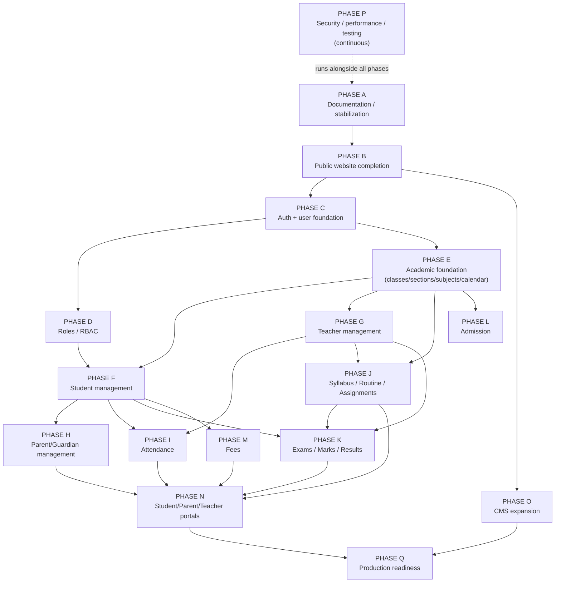

# PROJECT MASTER PLAN
## Green Leaf International School & College — Digital School Platform

> **SOURCE OF TRUTH.** All future development work MUST follow this document.
> Before any coding task: read this file + `SYSTEM_DESIGN.md` (see §25 Development
> Rule), locate the relevant checklist item, audit the existing implementation,
> implement the minimum required change, test it, then update BOTH documents.
>
> **Checkbox legend.**
> `[x]` = CURRENT / VERIFIED — implemented and verified through the full relevant
> flow (UI + API + backend logic + database + authorization where applicable).
> `[ ]` = missing, incomplete, broken, UI-only, backend-only, DB-only, not fully
> connected, or not verified. Partial items carry a `Status: PARTIAL` block and
> are always marked `[ ]` (never `[x]`).
> **PROPOSED / FUTURE** marks planned work; it is never presented as existing.
>
> **Section semantics.** §4 Existing Features records what exists today (a page
> existing with static copy is a fact and may be `[x]` there). §6–§13 checklists
> measure existence against the TARGET definition of the feature — a target item
> whose real flow is incomplete is `[ ]` with a PARTIAL block, even when a basic
> version is listed in §4.
>
> Audit: 2026-09-26. Post-audit validation (re-verified against source, docs
> corrected): 2026-09-26. No feature was assumed from UI alone. Phase B.6
> (Downloads Center) implemented + re-verified 2026-09-27 against source and
> live API.

---

## 1. Project Overview

Green Leaf International School & College ("Green Leaf") is a production-oriented,
full-stack school website currently in its **public website + CMS (Phase E) stage**.

- **Three apps, one monorepo:** public site (`client/`), Express API (`server/src/`),
  admin panel (`server/admin/`), plus `shared/` config/constants used by all three.
- **Current purpose:** a premium public-facing school website whose content
  (identity, navigation, homepage sections, leadership messages, reusable blocks,
  news/notices, images) is managed end-to-end through an authenticated Admin Panel.
- **Target purpose (this plan):** evolve into a complete digital school platform —
  public website **+** academic management portal **+** student / parent / teacher
  portals with role-based access — WITHOUT rewriting the existing architecture.

## 2. Project Goals

1. Preserve and extend the existing working architecture (no rewrites).
2. Complete the public website content coverage (About, Academics, Faculty,
   Facilities, Gallery, Downloads, Fees, Contact — all DB-backed like the Homepage).
3. Introduce safe, incremental role-based access (student / parent / teacher / admin)
   on top of the existing session-auth foundation (see SYSTEM_DESIGN RBAC section).
4. Never expose private student data publicly; portal data is owner-scoped.
5. Keep the established conventions: centralized services, context providers with
   fallbacks, validation layers, migration-first database changes, admin-first content.

## 3. Current System Summary

Verified by audit + post-audit validation (2026-09-26):

| Area | State |
|---|---|
| Public website | React 18 + Vite SPA, 8 routes (7 pages + news detail), Tailwind design system, DB-driven content with graceful fallbacks. **No catch-all 404 route** (see §20.14) |
| Backend | Express (ESM) on Node 18+, MySQL/MariaDB via mysql2 pool, service/controller/validator layering |
| Database | MySQL `greenleaf_school`, 7 tables via 9 idempotent migrations + 5 seed files; 2 real FKs (navigation self-FK, leadership_messages→leadership_sections) |
| Auth | Admin-only. Email+password (bcrypt-12) → HMAC-signed HttpOnly session cookie. No public/portal auth yet |
| Admin panel | Separate React SPA (port 5174) with 6 CMS modules behind AuthGate |
| File uploads | Hardened pipeline: magic-byte check → sharp sanitize/re-encode WebP → server-generated filenames. Documents (Phase B.6): PDF allowlist + %PDF- magic bytes → server-generated filenames |
| Security | Helmet, strict CORS, global + login + upload rate limiters, path-traversal-safe file serving, fail-closed admin auth |
| Portals | **None.** No student/teacher/parent accounts, no academic entities |
| Testing | Manual API test scripts only (`scripts/*.mjs`, `scripts/lm-manual-tests.cjs`). No automated test suite |
| Deployment | Dev-oriented (Vite dev + nodemon). Cloudflare quick-tunnel documented for temporary public demo. No production deployment pipeline |

## 4. Existing Features

*(Facts about what exists today — verified working as described.)*

### 4.1 Public website (`client/`)
- [x] Homepage — hero slider (Ken Burns, reduced-motion aware)
- [x] Homepage — Leadership Message section (DB-backed, 2×2 grid, empty-state placeholders)
- [x] Homepage — Recent News & Notices preview (first 3 + "Show All" expand)
- [x] Homepage — Student Life image grid (CMS-managed content)
- [x] Homepage — Academics preview section
- [x] Homepage — Video showcase carousel (multi-video, swipe/keyboard/progress bar)
- [x] Homepage — Admissions CTA band (reusable block)
- [x] Homepage — Map + location card (embed + directions, configured-state fallbacks)
- [x] About page (static/placeholder copy: story, values, vision & mission)
- [x] Academics page (static/placeholder copy: curriculum overview, programs)
- [x] Admissions page (static process steps + requirements list, reusable CTA)
- [x] Campus page (facilities grid + static photo gallery)
- [x] News page — carousel ticker mode + "Show All" grid mode
- [x] News detail page (`/news/:slug`, 404-safe for unknown slugs)
- [x] Downloads Center (`/downloads`, **Phase B.6**): DB-backed PUBLISHED-only list, category chips (non-empty categories only), honest loading/empty states, secure per-id download links — no fallback files fabricated
- [x] Contact page — details card, social links, map, client-validated contact form (UI-only; see §20.3)
- [x] Dynamic DB-driven navbar (hierarchical menu, dropdowns, mobile menu, ticker)
- [x] Footer (central settings-driven)
- [ ] **404 page for unknown public URLs — MISSING.** No `*` catch-all route exists in `client/src/App.jsx`; unknown paths render the layout with an empty content area (the admin SPA has a `*` fallback; the public site does not)
- [x] Route-transition animations + scroll restoration
- [x] ErrorBoundary at app root
- [x] Central context providers: Settings, HomeContent, ReusableContent, News — one fetch each, siteConfig/homeContent fallbacks, site never blanks on API failure

### 4.2 Backend API (`server/src`)
- [x] `GET /api/health`
- [x] Admin auth: `POST /api/auth/login`, `GET /api/auth/me`, `POST /api/auth/logout`
- [x] Public navigation tree: `GET /api/navigation`
- [x] Admin navigation CRUD: `GET/POST/PUT/DELETE /api/admin/navigation(/:id)`
- [x] Leadership: public `GET /api/leadership-messages`, `GET /api/leadership` (combined payload); admin CRUD + reorder + portrait upload (`POST /api/admin/leadership-messages/image`) + section settings (`/api/admin/leadership-messages`, `/api/admin/leadership-section`)
- [x] Site settings: public `GET /api/settings` (effective merged settings); admin `GET/PUT /api/admin/settings` (retires legacy `contact.address` with 400)
- [x] Page sections: public `GET /api/pages/home` (resolved sections); admin `GET /api/admin/pages/home` + `PUT /api/admin/pages/home/sections/:key` (Phase B: hero, newsPreview, lifeAtSchool, videoShowcase, admissionsCta)
- [x] Content blocks: public `GET /api/content/blocks`; admin GET/PUT/PATCH active/DELETE with delete protection for referenced blocks (409 names consumers) (Phase D)
- [x] News: public `GET /api/news` (supports `?type=&limit=&offset=` — type filtering EXISTS at API level) + `GET /api/news/:slug` (PUBLISHED only, `dateLabel` fixed to Asia/Dhaka); admin full CRUD + `PATCH /:id/status` lifecycle (Phase E)
- [x] Image uploads: `POST /api/admin/uploads/image` (admin-gated, dedicated limiter); public serving `GET /api/uploads/leadership/:file` and `/api/uploads/images/:file` (path-traversal-safe)
- [x] Document uploads + Downloads (**Phase B.6**): `POST /api/admin/uploads/document` (PDF-only + magic bytes, admin-gated, shared upload limiter); public `GET /api/downloads` (+ `/categories`, safe projection, PUBLISHED only); secure DB-mediated serving `GET /api/downloads/:id/file` (attachment + nosniff; DRAFT/ARCHIVED/missing → 404); admin `GET/POST/PUT/PATCH/DELETE /api/admin/downloads(/:id)`
- [x] Global JSON error handler, JSON-body parse error handler, 404 handler (API)
- [x] Rate limiting: global API (600/15min, keyed by admin identity or IP), login (10/10min), uploads (30/15min); draft-7 `Retry-After` headers
- Note (verified): public news endpoints send `Cache-Control: no-store`; other GET endpoints and `/api/uploads/*` send no cache headers

### 4.3 Admin panel (`server/admin/`)
- [x] Login page + session restore (`/api/auth/me`) + logout, AuthGate on every route
- [x] Dashboard (static hub with links to modules)
- [x] Navigation Management (menu + submenu CRUD)
- [x] Leadership Management (messages + reorder + portraits + section settings)
- [x] Site Settings (identity, branding, contact, social, location, SEO groups)
- [x] Homepage Management (hero, news preview, life at school, video showcase, CTA)
- [x] Content Center (Location & Map, Reusable Content blocks, News & Notices)
- [x] News Management (full CRUD, DRAFT → PUBLISHED → ARCHIVED lifecycle)
- [x] ImageUploader component wired to the secure upload endpoint
- [x] ConfirmDialog / Feedback UX components; 401/503 → global session drop; 429 Retry-After surfaced
- [x] Catch-all route (`*` → dashboard/login redirect)

### 4.4 Database (`server/sql`)
- [x] `navigation_items` (hierarchical, self-referencing FK with RESTRICT, CHECK constraints)
- [x] `leadership_sections` (section copy: eyebrow/title/description/is_active)
- [x] `leadership_messages` (role, name, title, message, image_url/alt, sort_order, is_active; **FK `section_id → leadership_sections.id` ON DELETE RESTRICT** per migration 004; indexes: (is_active, sort_order) and (section_id, sort_order))
- [x] `admin_users` (bcrypt hashes only, is_active, unique email)
- [x] `site_settings` (one row per dotted key, 6 groups; 24 seeded keys)
- [x] `page_sections` (page + section_key UNIQUE, per-section validated JSON)
- [x] `content_blocks` (block_key UNIQUE, block_type, JSON content, delete-protection via API)
- [x] `news_items` (slug UNIQUE, type, status lifecycle, UTC dates, public/admin indexes)
- [x] Migration runner + seed runner + verifier (`npm run db:migrate|db:seed|db:verify|db:setup`) and `admin:create` script (interactive + CLI flags)

## 5. Target System

```
PUBLIC WEBSITE  +  ACADEMIC MANAGEMENT  +  STUDENT PORTAL
                                     +  PARENT/GUARDIAN PORTAL
                                     +  TEACHER PORTAL
                                     +  ADMIN / CMS
```

Access ladder (target): PUBLIC → STUDENT → PARENT/GUARDIAN → TEACHER → ADMIN.
The existing role architecture is **admin-only**; the ladder will be EXTENDED,
not replaced (see §11 and the SYSTEM_DESIGN RBAC strategy — PROPOSED / FUTURE).

## 6. Public Website Plan

Measured against the target definition of each feature.

### HOME
- [x] Hero (slider, CMS-editable) — verified working flow
- [ ] Welcome Message
  - Status: PARTIAL
  - Existing: hero subtext carries a welcome-style line
  - Missing: standalone welcome message block
  - Required work: add `welcome` section to `page_sections` (page='home') if desired
- [x] About School (homepage Academics preview + Student Life)
- [x] Principal/Head Teacher Message (Leadership Message section, role field supports any role)
- [ ] Latest Notice (homepage shows the 3 newest items of ALL types; no notice-specific block)
  - Status: PARTIAL
  - Existing: central news preview includes NOTICE-type items
  - Missing: notice-only highlighting/filtering on the homepage
- [x] Latest News
- [ ] Upcoming Events (news has type=EVENT but no date-based "upcoming" view)
- [ ] Academic Calendar
- [ ] Facilities (homepage-level; Campus grid exists but is static)
  - Status: PARTIAL
- [ ] Achievements
- [x] Student Activities (Student Life grid; CMS-managed content)
- [ ] Gallery (homepage-level; Campus gallery is now DB-backed (Phase B.2); no homepage gallery section)
- [x] Important Links (navigation-driven CTAs; no dedicated links block)
- [x] Contact (Map section + footer)
- [ ] Why Choose Our School

### ABOUT / ORGANIZATION
- [x] About Us (page UI: hero, story, values, vision & mission — **Phase B.3**: story/values/vision&mission DB-backed via `page_sections` page='about' + admin editing; hero remains code-structure; verified school history still pending)
- [ ] School History (placeholder text only)
- [ ] Mission & Vision (placeholders awaiting verified statements)
  - Status: PARTIAL — UI exists, verified content does not
- [ ] Goals & Objectives
- [x] Head Teacher Message (Homepage Leadership section)
- [ ] Managing Committee (beyond leadership messages)
- [ ] Organization Structure
- [ ] Infrastructure (Campus overview — **Phase B.3**: copy now DB-backed via `page_sections` page='campus'; verified content still placeholder)
  - Status: PARTIAL
- [ ] Facilities (Campus facilities grid — **Phase B.3**: heading + cards DB-backed via `page_sections` page='campus'; verified content still placeholder)
  - Status: PARTIAL
- [ ] Achievements
- [ ] Awards / Recognition

### ACADEMICS
- [ ] Academic Calendar
- [ ] Class Routine
- [ ] Exam Routine
- [ ] Syllabus
- [ ] Weekly Syllabus
- [ ] WT Question
- [ ] WT Answer
- [ ] Assignment / Homework
- [ ] Academic Rules
- [ ] Examination System (Academics page overview copy only)
  - Status: PARTIAL
  - Existing: programs/overview/environment/CTA copy now DB-backed (**Phase B.3**, `page_sections` page='academics' + admin editing); no exam entities or routines
  - Required work: future exam module (Phase K)
- [ ] Holiday List

### TEACHERS & STAFF
- [x] Teachers (public directory) — **Phase B.5 DONE**: public `/teachers` page, static-first (audit found NO verified teacher/staff data in repo or DB — nothing fabricated; honest per-group empty states; Leadership messages reused, not duplicated; footer link added; future `/api/teachers` migration seam documented)
- [ ] Employees / Staff — directory group exists on `/teachers` (empty pending verified data)
- [ ] Teacher Profiles — deferred to the Teachers/Employees management phase (structured profiles + admin CMS)
- [ ] Department-wise Teachers
- [ ] Subject-wise Teachers
- [ ] Teacher Schedule

### STUDENTS
PUBLIC:
- [x] Student Activities (Homepage Student Life + Campus gallery)
- [ ] Student Achievements
- [ ] Clubs
- [ ] Sports (facilities mention only)
  - Status: PARTIAL
- [ ] Competitions
- [ ] Success Stories

PRIVATE / AUTHENTICATED (PROPOSED / FUTURE — see §7):
- [ ] Student Profile
- [ ] Attendance (Present/Absent/Leave)
- [ ] Class Routine (personalized)
- [ ] Weekly Syllabus (personalized)
- [ ] Assignment
- [ ] Exam Routine (personalized)
- [ ] Exam Questions
- [ ] Results
- [ ] Academic Progress
- [ ] Notices (role-targeted)
- [ ] Fees

### EXAMINATION & RESULT
- [ ] Exam Schedule
- [ ] Exam Routine
- [ ] Exam Rules
- [ ] Question Papers
- [ ] WT Result
- [ ] Half-Yearly Result
- [ ] Annual / Full-Yearly Result
- [ ] Merit List
- [ ] Result Search
- [ ] Academic Performance

### NOTICE & NEWS
- [ ] Notice Board (notice-specific view)
  - Status: PARTIAL
  - Existing: unified news list + detail + ticker; **type-filtered views now shipped (B item 4)** — News page chips cover All/News/Events/Notices/Announcements
  - Missing: category-specific pages/flows beyond the News page filter
  - Required work: dedicated category landing pages if ever needed (small follow-up)
- [ ] Academic Notice (type value exists in schema; no category-specific flow)
- [ ] Examination Notice (same)
- [ ] Admission Notice (same)
- [ ] Holiday Notice (same)
- [ ] Circular (separate downloadable circular concept)
- [x] News (verified end-to-end: admin CRUD → DB → public list/detail/ticker/preview)
- [ ] Events (type exists; no dedicated Events page/upcoming view)
- [ ] Role-specific notices (targeting not in schema — PROPOSED / FUTURE)

### ADMISSION
- [x] Admission Information (Admissions page)
- [ ] Why Choose Us (admission-specific)
- [ ] Admission Requirements (static list; not CMS-managed)
  - Status: PARTIAL
- [ ] Available Classes (static program cards only)
- [ ] Admission Schedule
- [ ] Application Process (static 4-step list; not CMS-managed)
  - Status: PARTIAL
- [ ] Admission Form (online application — none; only the UI-only contact form)
- [ ] Fees Structure (admission-related)
- [ ] Required Documents (static list)
  - Status: PARTIAL
- [ ] Admission Notice (type value exists; no category-specific flow)
- [ ] Admission Result
- [ ] FAQ

### STUDENT LIFE
- [ ] Sports (Campus facilities mention)
  - Status: PARTIAL — no dedicated sports content
- [ ] Cultural Activities (images only)
- [ ] Debate
- [ ] Science Fair
- [ ] Clubs
- [ ] Scouts / BNCC
- [ ] Competitions
- [ ] Educational Tours
- [ ] Events
- [ ] Student Achievements — **not present** (Status: MISSING)

### GALLERY
- [x] Photo Gallery (target: DB-backed entity with categories + admin management) — **Phase B.2 COMPLETE, verified end-to-end**: `gallery_items` table, admin Gallery page (CRUD + publish lifecycle + category/status filters), public `/api/gallery` (+ `/categories`), Campus grid DB-backed with hardcoded-image fallback, new `/gallery` page with category chips + hover captions
  - Remaining (optional): lightbox viewer, video gallery, category landing pages
- [ ] Video Gallery
  - Status: PARTIAL — Homepage video showcase is curated CMS content, not a gallery entity
- [ ] Academic Events / Sports / Cultural Programs / Science Fair / Educational Tours / School Events galleries as landing pages (categories EXIST in the entity + filter; dedicated pages do not)

### DOWNLOAD CENTER
All infrastructure shipped as ONE coherent module (**Phase B.6**): one `downloads`
entity (migration 012), one admin management flow (admin `/downloads`), one public
Center (`/downloads` + `/api/downloads`). The controlled category vocabulary:
Prospectus, Syllabus, Routine, Question Papers, Forms, Notices, Circulars,
Academic Documents, Rules & Regulations, Other. PDF-only uploads (10 MB),
publish lifecycle DRAFT → PUBLISHED → ARCHIVED. Individual items below stay
unchecked only because the school has not yet supplied verified files — the
infrastructure is DONE and identical for every row:
- [ ] Prospectus — content pending verified files
- [ ] Syllabus downloads — content pending
- [ ] Routine downloads — content pending
- [ ] Question Papers — content pending
- [ ] Forms — content pending
- [ ] Notices (downloadable) — content pending
- [ ] Circulars — content pending
- [ ] Academic Documents — content pending
- [ ] Rules & Regulations — content pending

### FACILITIES
- [ ] Facilities CMS (target: admin-managed facilities content)
  - Status: PARTIAL
  - Existing: static Campus grid covering Classrooms, Library, Computer Lab, Science Lab, Playground, Auditorium, Art Studio, Cafeteria
  - Missing: CMS management; Prayer Room, Transport, Medical/First Aid, Security entries

### FEES
PUBLIC (PROPOSED / FUTURE):
- [ ] Admission Fees
- [ ] Monthly Fees
- [ ] Other Fees
- [ ] Fees Structure
- [ ] Payment Instructions

PRIVATE (PROPOSED / FUTURE):
- [ ] Current Due
- [ ] Paid Fees
- [ ] Payment History
- [ ] Invoice
- [ ] Receipt

### CONTACT
- [x] Contact Information (settings-driven, verified)
- [x] Address / Phone / Email / Office Hours (settings-driven, verified)
- [x] Map (embed + directions with configured-state fallback, verified)
- [x] Social Media (links rendered from settings on Contact page + Footer; null links hidden — verified)
- [x] Contact Form (target: submissions persisted + admin-visible) — **Phase B.1 COMPLETE, verified end-to-end** (form → POST /api/contact → validation → service → model → contact_messages → admin Contact Inbox → status lifecycle; 48-point API test green; both SPAs build; test script `scripts/test-contact-api.mjs`)
  - Existing: full form UI + client-side validation + server-side validation + persistence + admin inbox (list/filter/detail/status/delete)
  - Remaining (optional, not required for [x]): email notification on submit, spam protection beyond rate limiting, pagination
- [ ] Email/notification delivery on form submit (PROPOSED / FUTURE)

## 7. Student Portal Plan

PROPOSED / FUTURE. No student authentication or portal exists.

- [ ] Student login (role-scoped accounts)
- [ ] Dashboard
- [ ] My Profile
- [ ] My Attendance (Present / Absent / Leave)
- [ ] My Class Routine
- [ ] My Weekly Syllabus
- [ ] Assignment
- [ ] Exam Routine
- [ ] Question Papers
- [ ] Results
- [ ] Academic Progress
- [ ] Notices (student-relevant)
- [ ] Events
- [ ] Fees
- [ ] Downloads

**Hard rule:** a student can read ONLY their own records — all portal queries
must be scoped server-side by the authenticated student's id (never by
client-supplied ids). See SYSTEM_DESIGN "Public vs Private Data" + RBAC strategy.

## 8. Parent Portal Plan

PROPOSED / FUTURE module (roadmap only). Depends on Phase F (students) and
Phase H (guardian management).

- [ ] Guardian accounts linked to one or more students
- [ ] Dashboard
- [ ] Child Profile (per child switcher)
- [ ] Child Attendance
- [ ] Leave view
- [ ] Class Routine
- [ ] Weekly Syllabus
- [ ] Assignment
- [ ] Exam Routine
- [ ] Results
- [ ] Academic Progress
- [ ] Notices
- [ ] Fees
- [ ] Payment History
- [ ] Receipts
- [ ] School Events

Multi-child support: one guardian row ↔ N `student_guardians` links (SYSTEM_DESIGN
proposed database).

## 9. Teacher Portal Plan

PROPOSED / FUTURE. Depends on Phase E (academic foundation) and Phase G
(teacher management).

- [ ] Teacher login (role-scoped)
- [ ] Dashboard
- [ ] My Profile
- [ ] Assigned Classes
- [ ] Assigned Subjects
- [ ] My Students (scoped to assigned classes)
- [ ] Attendance entry
- [ ] Assignment management
- [ ] Weekly Syllabus management
- [ ] Question Management
- [ ] Marks Entry
- [ ] Result Management
- [ ] Student Performance view
- [ ] Notices
- [ ] Academic Resources
- [ ] Class Routine view

**Hard rule:** teacher queries are restricted to classes/subjects assigned to
them (assignment tables drive authorization, not client input).

## 10. Admin Panel Plan

Existing (do NOT duplicate):
- [x] Dashboard hub
- [x] Navigation management
- [x] Leadership messages + section settings
- [x] Site settings (identity/branding/contact/social/location/SEO)
- [x] Homepage sections CMS
- [x] Content Center (location, reusable blocks, news & notices)
- [x] News/Notices CRUD with lifecycle
- [x] Image upload pipeline

To build (only after audit-confirmed need; no duplicates):
- [ ] Admin user management UI (list/create/deactivate admins; script-only today)
- [ ] Roles & permissions (currently single implicit admin role)
- [ ] Students CRUD (+ guardians)
- [ ] Teachers / Employees CRUD
- [ ] Classes / Sections / Subjects
- [ ] Academic Calendar
- [ ] Syllabus / Weekly Syllabus
- [ ] Questions / Answers
- [ ] Assignments
- [ ] Class Routine
- [ ] Exam Routine
- [ ] Exams / Marks / Results
- [ ] Attendance
- [ ] Leave management
- [ ] Events (separate from news)
- [ ] Admission applications
- [ ] Fees (structure + student ledger)
- [ ] Gallery management
- [x] Downloads management (**Phase B.6** — `/downloads` admin page: upload/create/edit/publish lifecycle/delete + file metadata)
- [ ] Facilities CMS
- [x] About page CMS (**Phase B.3** — About/Academics/Campus page content via generic Page Content pages; Campus facilities + Academics informational copy included)
- [ ] Managing Committee CMS
- [ ] Site Settings extensions (per-page SEO)
- [ ] Contact message inbox
- [ ] Notification center

## 11. Authentication & Authorization

### Existing (CURRENT / VERIFIED)
- [x] Admin login: email + password, bcrypt(12), timing-safe compare (dummy hash), active-only
- [x] Session: HMAC-SHA256 signed stateless token, HttpOnly SameSite=Lax cookie, TTL 12h (SESSION_TTL_HOURS), secure in production
- [x] Fail-closed admin API (503 when nothing configured), generic 401s, no detail leakage
- [x] `GET /api/auth/me` re-reads the live profile (deactivation kills session immediately)
- [x] Transition Bearer ADMIN_TOKEN for scripts (deprecated, removable)
- [x] Single implicit role: authenticated admin (no roles/permissions table)

### To build (PROPOSED / FUTURE — extend, never replace)
- [ ] Unified identity model with roles (design in SYSTEM_DESIGN RBAC strategy)
- [ ] Portal login endpoints (role-aware)
- [ ] Ownership-scoped authorization middleware (student→self, guardian→linked children, teacher→assigned classes)
- [ ] Role-specific notice targeting
- [ ] Audit logging of privileged actions
- [ ] Password reset flows (all roles)

## 12. Database Modules

Existing tables (CURRENT / VERIFIED — see SYSTEM_DESIGN for full detail):
- [x] admin_users
- [x] navigation_items
- [x] leadership_sections, leadership_messages (FK: messages.section_id → sections.id, RESTRICT)
- [x] site_settings
- [x] page_sections
- [x] content_blocks
- [x] news_items

Proposed / future (PROPOSED — NOT present; do not treat as existing):
- [ ] users (unified identity) / roles / permissions / role_permissions
- [ ] students, guardians, student_guardians
- [ ] teachers, employees, teacher_assignments
- [ ] classes, sections, subjects, class_subjects
- [ ] academic_calendar, holiday_list
- [ ] class_routines, exam_routines
- [ ] syllabi, weekly_syllabi
- [ ] assignments, questions, answers
- [ ] exams, marks, results, merit_lists
- [ ] attendance, leave_requests
- [ ] notice_targets (role-targeted notices; may extend news_items)
- [ ] admission_applications
- [ ] fee_structures, student_fees, payments, invoices
- [x] gallery_items
- [ ] videos
- [x] downloads (**Phase B.6** — migration 012; SAFE managed file references only, DB-mediated secure serving)
- [x] contact_messages
- [ ] audit_logs

## 13. API Modules

Existing (CURRENT / VERIFIED):
- [x] /api/health
- [x] /api/auth/*
- [x] /api/navigation + /api/admin/navigation
- [x] /api/leadership, /api/leadership-messages (+ admin CRUD/reorder/image), /api/admin/leadership-section
- [x] /api/settings + /api/admin/settings
- [x] /api/pages/home + /api/admin/pages/home
- [x] /api/content/blocks + /api/admin/content/blocks
- [x] /api/news (with ?type=&limit=&offset=) + /api/admin/news
- [x] /api/uploads (public serving) + /api/admin/uploads/image

Proposed / future (PROPOSED — public + admin pairs unless noted):
- [x] /api/gallery (public GET + /categories) + /api/admin/gallery (full CRUD + status)
- [x] /api/contact (public POST) + /api/admin/contact-messages
- [x] /api/downloads (public list/categories + secure DB-mediated file serving) + /api/admin/downloads (full CRUD + status) (**Phase B.6**)
- [ ] /api/teachers (public directory) + /api/admin/teachers
- [ ] /api/events (upcoming view) — or extend /api/news filters
- [ ] /api/academics content (calendar, routines, syllabi) + admin
- [ ] /api/admissions (content + applications) + admin
- [ ] /api/fees (public structure; private ledger) + admin
- [ ] /api/students (admin CRUD; portal /api/portal/student/*)
- [ ] /api/portal/guardian/*
- [ ] /api/portal/teacher/*
- [ ] /api/admin/users, /api/admin/roles

## 14. UI/UX Requirements

- [x] Tailwind-based design system (forest/leaf/cream/charcoal/gold palette, serif headings, Inter body)
- [x] Responsive layouts (mobile menu, grids, hero adaptations)
- [x] Loading / error / empty states with intentional fallbacks (no fake data as real)
- [x] Accessibility: aria roles on nav/carousel/dialogs, focus management, Escape/arrow keys, reduced-motion support
- [x] Scroll reveal + page transitions
- [x] ErrorBoundary
- [ ] Public 404 page (catch-all route) — see §20.14
- [ ] Dark mode
- [ ] Lightbox for galleries
- [ ] Skeleton loaders (currently text/status lines)
- [ ] Bangla-language support (school context likely requires it; English-only today)

## 15. Security Requirements

Implemented (CURRENT / VERIFIED):
- [x] Helmet security headers
- [x] Strict CORS allowlist (client 5173, admin 5174, credentials)
- [x] HttpOnly signed session cookies; no tokens in JS; secure flag in production
- [x] bcrypt password hashing (never plaintext)
- [x] Timing-safe comparisons (session sig, bearer token, login compare)
- [x] Rate limiting (global / login / upload) with identity-aware keys
- [x] Image pipeline: magic-byte allowlist, sharp re-encode (EXIF stripped), server-generated filenames, decompression-bomb limits, 10 MB cap
- [x] Path-traversal-safe file serving (regex + containment checks)
- [x] SQL: parameterized queries, named placeholders, multipleStatements disabled
- [x] Fail-closed auth middleware; generic error messages; no stack traces in prod
- [x] DB constraints: FKs, UNIQUEs, CHECKs (enum + non-empty + non-negative)

To build (PROPOSED / FUTURE):
- [ ] CSRF hardening review for state-changing admin routes (SameSite=Lax today)
- [ ] Account lockout/progressive delay beyond rate limit
- [ ] Password reset with expiring tokens
- [ ] Audit logs for privileged actions
- [ ] Field-level encryption if sensitive student data is stored
- [ ] Antivirus scanning note (re-encode is mitigation, not AV)

## 16. SEO Requirements

- [x] Central SEO config (title/description) + DB-backed overrides via settings
- [x] Head sync component (title, favicon, OG tags on settings ready)
- [x] OG image config
- [ ] Per-page titles/descriptions
- [ ] Canonical URLs
- [ ] sitemap.xml / robots.txt
- [ ] Structured data (Organization, School, NewsArticle JSON-LD)
- [ ] SSR/prerendering consideration (SPA today — crawlers get empty root for detail pages)

## 17. Performance Requirements

- [x] Lazy-loaded images below the fold; fetchPriority for hero
- [x] WebP re-encode of uploads (smaller payloads)
- [x] Single-fetch content providers (no waterfalls), GET dedupe in admin client
- [x] Vite production builds with sourcemaps
- [x] `Cache-Control: no-store` on public news endpoints (correctness measure; no positive caching yet)
- [ ] Image CDN / cache headers for uploads (uploads currently send NO cache headers)
- [ ] HTTP caching (ETag/Cache-Control) on other public APIs
- [ ] Code splitting / route-level lazy loading
- [ ] DB read replicas / query review at scale (low priority at current traffic)

## 18. Testing Requirements

- [x] Manual API test scripts (leadership API, image upload, lm-manual-tests)
- [ ] Automated unit tests (services/validators first)
- [ ] Automated API integration tests (supertest)
- [ ] Frontend component tests
- [ ] E2E smoke tests (Playwright) for public flows + admin login
- [ ] CI pipeline running lint + tests on PR
- [ ] Load test of rate-limited endpoints

## 19. Deployment Requirements

- [x] Dev orchestration (`npm run dev` — client+server+admin concurrently)
- [x] Production build scripts for client & admin
- [x] Fixed ports with fail-loud behavior (5000/5173/5174)
- [x] Cloudflare quick-tunnel procedure for temporary public demo (docs/LOCAL_PUBLIC_ACCESS.md)
- [ ] Production environment provisioning (VPS + Nginx + PM2)
- [ ] Managed MySQL with automated backups
- [ ] HTTPS + domain + hardened CORS origins
- [ ] Static hosting/CDN for built client & admin (or same-origin reverse proxy)
- [ ] Upload storage strategy for production (volume vs object storage)
- [ ] Health-check-based restarts / monitoring

## 20. Known Problems

Each problem: **Priority** (P1 highest) · **Impact** · **Status** · **Recommended
solution** · **Dependency** · **Suggested phase**. Do NOT auto-fix; implement via
the roadmap.

| # | Problem | Priority | Impact | Status | Recommended solution | Dependency | Suggested phase |
|---|---|---|---|---|---|---|---|
| 1 | **Stale docs/**: `docs/API.md`, `DATABASE.md`, `ARCHITECTURE.md` describe the pre-implementation plan ("TBD Phase 5", planned tables) | P2 | Misleads contributors; contradicts reality | Open | Refresh the three files to match reality or replace with pointers to SYSTEM_DESIGN.md | None | Phase A |
| 2 | **Wrong env-var documentation**: `docs/DEPLOYMENT.md` lists `JWT_SECRET`/`JWT_EXPIRES_IN`; real contract is `AUTH_SECRET` + `SESSION_TTL_HOURS` | P2 | Broken deployment instructions | Open | Correct DEPLOYMENT.md to the verified env contract (SYSTEM_DESIGN §AF) | None | Phase A |
| 3 | **Contact form has no backend**: submissions are never stored or delivered | P1 | Only user-facing flow that silently discards data; reputational risk | **RESOLVED (Phase B.1)** — `contact_messages` table + `POST /api/contact` + admin Contact Inbox shipped and verified end-to-end (48-point API test); email notification remains future | None (uses established patterns) | **DONE (Phase B.1)** |
| 4 | **Hardcoded page content breaks the DB-driven convention**: homepage Academics preview (About, Academics, Campus copy now DB-backed — Phase B.3) | P2 | Inconsistent CMS; content edits require code deploys | Open | Extend `page_sections` to the homepage Academics preview | None | Phase B |
| 5 | **No automated tests** — only manual scripts; lint is the only guard | P1 | Regression risk grows with every phase; portals later need safety net | Open | Add Vitest (validators/services) → supertest (routers) → Playwright smoke; CI | None; grows per phase | Start Phase P immediately (validators first), continuous |
| 6 | **Single implicit admin role** — `admin_users` has no role column; every admin is equal | P1 (blocks portals) | Cannot implement least-privilege access for future roles | Open | RBAC design (SYSTEM_DESIGN) → roles/permissions tables → middleware evolution | None (design now); implementation before Phase F | Phase D |
| 7 | **`shared/constants/api.js` advertises planned routes that don't exist** (`/api/home`, `/api/about`, `/api/academics`, `/api/admissions`, `/api/videos`; `/api/contact` and `/api/gallery` now EXIST) | P3 | Misleading constants; dead references | Open | Remove unimplemented constants or comment them as PROPOSED | None | Phase A |
| 8 | **`.env.example` starts with stray `[TEMPLATE]` lines** | P3 | Cosmetic confusion | Open | Remove the stray lines | None | Phase A |
| 9 | ~~**News page has no type filtering in the UI** although `GET /api/news?type=` exists~~ | P3 | Weaker notice-board UX than the data model allows | **RESOLVED (B item 4)** — News page type chips + Upcoming Events view shipped | ~~Add type tabs/filter~~ | None | Phase B |
| 10 | **No public 404 page**: `client/src/App.jsx` has no `*` catch-all; unknown URLs render an empty layout | P2 | Confusing UX for mistyped URLs; SEO hygiene | Open | Add a `*` route rendering a styled NotFound page | None | Phase A or B (small, safe) |
| 11 | **Response-envelope inconsistency**: news endpoints return `{items}`/`{error}`; all other modules return `{success, message, data}` | P3 | Inconsistent client handling; minor | Open | Align news controller to the standard envelope (or document both as official) | None | Phase A/P (tiny refactor) |
| 12 | **No cache headers on `/api/uploads/*`** (news GETs already send `no-store`; uploads send nothing) | P3 | Repeat downloads; no cache busting on content change | Open | Add `Cache-Control: public, max-age=...` + immutable filenames already in place | None | Phase P |
| 13 | **News slugs editable** (intentional) — detail URLs can break if an admin edits a slug; no redirect/alias mechanism | P3 | Occasional broken links after admin edits | Open (accepted risk) | Optional slug-alias table or redirect map | None | Phase O |
| 14 | **README has encoding artifacts** (null-character block at end) | P3 | Cosmetic | Open | Clean the file tail | None | Phase A |

## 21. Technical Debt

- `middleware/adminAuth.js` is a deprecated re-export shim kept for forgotten imports — remove after import audit (low risk, grep first).
- Deprecated `ADMIN_TOKEN` Bearer transition path in sessionAuth — remove when no scripts depend on it.
- Minimal hand-rolled multipart parser in `middleware/upload.js` (single-file only) — fine now; replace with a maintained parser if multi-file needs appear.
- Some Pages import `siteConfig` directly (Academics, News hero) instead of `useSettings()` — inconsistent with the settings-first rule; harmless fallback duplication.
- `client/src/data/leadershipMessages.js` exists as a legacy local data file alongside the DB-backed hook — verify unused and remove.
- Admin `Dashboard` is an inline placeholder component inside `App.jsx` — extract when real dashboard stats arrive.
- No shared HTTP client for the public site (raw `fetch` per service) — acceptable; introduce one wrapper when auth/portal arrives.
- `leadership_sections` is managed via a bespoke inline router in server.js — fold into a routes file for consistency.
- News module deviates from the standard response envelope (see §20.11).

## 22. Future Improvements

- Unified portal shell: one authenticated area serving student/parent/teacher layouts by role.
- Notification architecture (in-app + email) built on a `notifications` abstraction.
- Download center with per-file metadata and view counters.
- Audit-log viewer in admin.
- Read-only public data API caching layer (ETag) before any scaling need.
- Bangla/English content fields (i18n) for public content entities.
- Soft-delete + versioning for CMS entities (page_sections history).

## 23. Dependency Graph & Development Phases

### 23.1 Module dependency graph (authoritative order)



Key ordering facts derived from the actual architecture:
- **Guardians depend on students** (H after F) — the guardian↔child link cannot exist first.
- **Attendance needs students + classes + teacher assignments** (I after E, F, G).
- **Exams/results need students, teachers, and ideally routines/syllabus** (K after F, G, J).
- **Portals come LAST** (N) — they are thin read/write surfaces over data modules;
  building them earlier would force rework of every scoping rule.
- **Public-website completion (B) has NO dependency on the auth/RBAC chain** and
  fixes the only user-facing broken flow — it goes first among code phases.
- **Admission (L) and public fee structures (M public part) depend only on
  classes/sections (E)** and can partially run in parallel with I/J.

### 23.2 Phase definitions

> Legacy note: the already-completed project phases "A–E" (settings, homepage
> sections, content centralization, reusable blocks, news) are DONE and are
> unrelated to the phase letters below.

**PHASE A — Documentation / stabilization** *(no behavior change)*
1. Refresh `docs/API.md`, `docs/DATABASE.md`, `docs/ARCHITECTURE.md` or replace with pointers to SYSTEM_DESIGN.md.
2. Fix `docs/DEPLOYMENT.md` env contract (AUTH_SECRET, not JWT_SECRET).
3. Clean `.env.example` stray `[TEMPLATE]` lines + README artifacts.
4. Remove/comment unimplemented constants in `shared/constants/api.js`.
5. Add public `*` 404 route + styled NotFound page.
6. (Optional, tiny) align news controller to the standard response envelope.
- Exit: docs match reality; unknown public URLs show a 404 page.

**PHASE B — Existing public website completion** *(no auth dependencies)*
1. ~~Contact form backend~~ — **DONE (Phase B.1)**: `contact_messages` migration 010 + `POST /api/contact` + admin Contact Inbox (`/contact-inbox`), verified end-to-end (`scripts/test-contact-api.mjs`, 48 checks).
2. ~~Gallery module~~ — **DONE (Phase B.2)**: `gallery_items` migration 011 + public `/api/gallery` (+ `/categories`) + admin Gallery page (`/gallery`) + new public `/gallery` page + Campus grid DB-backed with hardcoded-image fallback; shared image pipeline reused (no new upload surface); orphan-safe file cleanup; verified end-to-end (`scripts/test-gallery-api.mjs`, 54 checks). Homepage: no gallery section added — documented decision (no gallery slot exists; MASTER PLAN §11 rule).
3. ~~About/Academics/Campus sections DB-backed via `page_sections` extension~~ — **DONE (Phase B.3)**: existing `page_sections` table generalized to page identifiers `about` / `academics` / `campus` (NO new tables, NO migration needed); per-section fallback files in `shared/content/`; admin editing via ONE generic `PageContentManagement` page (About Page `/about-page`, Academics Page `/academics-page`, Campus Page `/campus-page`) reusing the section editor pattern; public `GET /api/pages/{about|academics|campus}`; verified end-to-end (`scripts/test-page-sections-api.mjs`, 57 checks) + regression suites green + both SPA builds green. Campus gallery integration untouched (heading copy only in page_sections; photos stay in `gallery_items`).
4. ~~News page type filtering (consume existing `?type=`) + Events upcoming view~~ — **DONE (B item 4)**: News page type chips (All/News/Events/Notices/Announcements) over the single central list; Upcoming Events view (published EVENT items with future dates, chronological) from the SAME data — event date = the content's `Event Date:` line (admin date picker), public `?type=` now validated + `?upcoming=true` projection added; verified end-to-end (`scripts/test-news-api.mjs`, 50 checks) + all regression suites + both SPA builds green. No new tables/APIs/entities.
5. ~~Teachers & Staff public directory (static-first if verified data isn't ready)~~ — **DONE (B item 5)**: audit confirmed NO teacher/staff/employee data exists anywhere (12 DB tables + full repo search — Case C) → static-first per plan: public `/teachers` page + `shared/content/teachersStaffContent.js` with EMPTY verified-data groups (no fabricated people); leadership messages REUSED (one source of truth); footer quick-link added; NO new tables/APIs/admin pages/migrations; person shape `{id, name, designation, department?, subject?, profile?, image?}` documented as the 1:1 seam for the future Phase G `/api/teachers`. Verified staff content remains PENDING (school must supply it).
6. ~~Downloads center (`downloads` entity + file serving reusing the upload pipeline)~~ — **DONE (B item 6)**: migration 012 `downloads` (title/description/category/file/original_filename/file_ext/file_bytes/status/sort_order); document uploads through the shared admin upload surface (POST /api/admin/uploads/document — PDF-only allowlist + %PDF- magic bytes, server-generated filenames, same 10 MB cap + dedicated limiter); public `/api/downloads` (+ `/categories`) with safe projection; secure DB-mediated serving `GET /api/downloads/:id/file` (PUBLISHED only, attachment + nosniff, no filename-based route); admin Downloads page + public `/downloads` Center with category chips + footer link; verified end-to-end (`scripts/test-downloads-api.mjs`, 80 checks incl. the 18-point security checklist) + all regression suites + both SPA builds green. Re-verified 2026-09-27 (80/80 + regressions + builds).
7. SEO completion (per-page meta, sitemap, robots, JSON-LD). ← **NEXT**
- Depends on: Phase A. Exit: every public page is CMS-managed; contact submissions persist.

**PHASE C — Authentication + user foundation**
1. Unified identity design (see SYSTEM_DESIGN RBAC strategy): `users` table with role + role-profile tables, admin_users migration path.
2. Password reset with expiring tokens (admin first).
3. Admin user management UI (list/create/deactivate).
4. Session token carries `role` claim (format-compatible extension).
- Depends on: Phase B (nothing in B blocks it, but B first keeps risk low). Exit: identities exist with roles; admin CRUD for accounts.

**PHASE D — Roles / RBAC**
1. `roles`, `permissions`, `role_permissions` tables (PROPOSED schema in SYSTEM_DESIGN).
2. `requireRole` / `requirePermission` middleware evolved from `adminAuth` (fail-closed preserved).
3. Audit logging of privileged actions (`audit_logs`).
4. Apply least-privilege defaults; all existing admin routes keep working.
- Depends on: C. Exit: two admins with different roles demonstrably see different permissions.

**PHASE E — Academic foundation**
1. `classes`, `sections`, `subjects`, `class_subjects` + admin CRUD.
2. `academic_calendar`, `holiday_list` + public display (Academics page).
3. Class/section assignment of students becomes possible (FKs ready for F).
- Depends on: C (admin CRUD), D (permissions refine authorization). Exit: classes/sections/subjects manageable; calendar public.

**PHASE F — Student management**
1. `students` (+ user identity link from C), class/section enrollment.
2. `guardians` + `student_guardians` (multi-child) — schema here, management UI in H.
3. Student admin CRUD + documents (uploads reuse existing pipeline).
- Depends on: E (classes/sections), C (identities). Exit: students enrolled with guardians linked.

**PHASE G — Teacher management**
1. `teachers`, `employees` + user identity link.
2. `teacher_assignments` (teacher ↔ class_subject) — THE authorization source for later phases.
3. Teacher admin CRUD; public teacher directory feed (Phase B item 5 consumes it).
- Depends on: E. Exit: teachers assigned to class-subjects.

**PHASE H — Parent/Guardian management**
1. Guardian management UI, invitation/credentials flow, child-linkage admin.
2. Guardian login readiness (role from C/D).
- Depends on: F. Exit: a guardian account can be linked to N children by an admin.

**PHASE I — Attendance**
1. `attendance` (student, class, date, status) + `leave_requests` workflow.
2. Teacher entry UI scoped by `teacher_assignments`; admin views; reports.
- Depends on: E, F, G. Exit: daily attendance entered by teachers, visible to admin.

**PHASE J — Syllabus / routine / assignments**
1. `syllabi`, `weekly_syllabi`, `class_routines`, `exam_routines`, `assignments`, `questions`, `answers`.
2. Public display (per class where public) + teacher authoring scoped by assignments.
- Depends on: E, G (K needs J). Exit: routines/syllabi manageable and displayed.

**PHASE K — Examination / marks / results**
1. `exams`, `marks`, `results`, `merit_lists`; marks entry scoped to teacher assignments.
2. Result publication workflow (draft → published) mirroring the news status pattern.
3. Result search + report cards.
- Depends on: F, G, J. Exit: a full exam cycle (create exam → marks → publish results) works.

**PHASE L — Admission**
1. Public admission content CMS (schedule, FAQ, available classes from E).
2. `admission_applications` + public form + admin review workflow.
- Depends on: E (classes); can partially parallel I/J. Exit: online application round-trips.

**PHASE M — Fees**
1. Public fee structures (independent).
2. `student_fees`, `payments`, `invoices` ledgers scoped to students; receipts.
- Depends on: F (students); public part depends on nothing. Exit: a student's fee ledger exists and is admin-manageable.

**PHASE N — Student / Parent / Teacher portals**
1. Portal shell (role-aware authenticated area) + ownership-scoped middleware.
2. Student portal: profile, attendance, routine, syllabus, assignments, results, fees, notices.
3. Parent portal: linked-children views of the same data + fee payment history/receipts.
4. Teacher portal: assigned classes/students, attendance entry, marks entry, resources.
5. Role-targeted notices (`notice_targets`).
- Depends on: C, D, F, G, H, I, J, K, M. Exit: all three portals live with least-privilege scoping verified.

**PHASE O — CMS expansion**
1. Remaining admin modules: managing committee, facilities CMS, per-page SEO, notification center, dashboard stats.
2. Slug-alias/redirect mechanism for edited news slugs (§20.13).
- Depends on: B (patterns), E–M as relevant. Exit: no hardcoded public content remains.

**PHASE P — Security / performance / testing** *(continuous, formalized here)*
1. Automated tests ramp: validators → services → routers → E2E (start immediately, not after N).
2. CI pipeline (lint + tests on PR).
3. CSRF review, account lockout, rate-limit load test.
4. HTTP caching for uploads/public GETs; code splitting.
- Depends on: runs alongside all phases; hardening gates exit of N. Exit: CI green; security checklist complete.

**PHASE Q — Production readiness**
1. VPS/Nginx/PM2 deployment, HTTPS, hardened CORS.
2. Managed MySQL + nightly backups + restore runbook (uploads included).
3. Monitoring/alerting on /api/health; logging upgrade.
- Depends on: N, O, P. Exit: production launch checklist complete.

## 24. Final Completion Checklist

A module may only be checked when UI + API + backend logic + database +
authorization (where applicable) + a tested working flow all exist.

- [x] Public website core (7 pages + news detail)
- [x] Dynamic navigation CMS
- [x] Site settings CMS (identity/branding/contact/social/location/SEO)
- [x] Homepage sections CMS
- [x] Leadership messages CMS
- [x] Reusable content blocks CMS
- [x] News/Notices CMS + public consumption
- [x] Secure image upload pipeline
- [x] Admin authentication (sessions)
- [x] Rate limiting & security headers
- [x] Migration/seed infrastructure
- [ ] Public 404 page
- [ ] Documentation refresh (docs/ parity)
- [x] Contact form backend + inbox
- [x] Gallery module
- [x] Downloads center (**Phase B.6** — `downloads` entity migration 012 + secure DB-mediated file serving + admin Downloads page + public `/downloads`)
- [x] Teachers/Staff directory (**Phase B.5** — static-first public `/teachers`; DB-backed directory + admin CMS deferred to the Teachers/Employees CRUD phase)
- [ ] Events module (upcoming view)
- [x] About/Academics content CMS parity (**Phase B.3** — +Campus; generic page-content editor)
- [ ] SEO completion (per-page, sitemap, JSON-LD)
- [ ] User foundation (identity + password reset + admin user UI)
- [ ] Roles & permissions
- [ ] Classes/Sections/Subjects
- [ ] Academic calendar
- [ ] Student schema + admin CRUD
- [ ] Guardian schema + linkage
- [ ] Teacher schema + class assignments
- [ ] Attendance system
- [ ] Leave management
- [ ] Routines (class/exam)
- [ ] Syllabus + weekly syllabus
- [ ] Assignments
- [ ] Exams/Marks/Results management
- [ ] Admission applications
- [ ] Fees (public structure + private ledger)
- [ ] Portal authentication (role-aware)
- [ ] Student portal (profile, attendance, results)
- [ ] Parent portal
- [ ] Teacher portal (attendance, marks entry)
- [ ] Notifications
- [ ] CMS expansion (facilities, committee, per-page SEO, dashboard)
- [ ] Automated tests + CI
- [ ] Production deployment + backups
- [ ] Bangla language support

## 25. Development Rule

From this point forward: **PROJECT_MASTER_PLAN.md = MASTER ROADMAP**;
**SYSTEM_DESIGN.md = MASTER TECHNICAL DESIGN**. Every future coding task must:

1. Read PROJECT_MASTER_PLAN.md.
2. Read SYSTEM_DESIGN.md.
3. Locate the relevant checklist item.
4. Audit the existing implementation.
5. Implement the minimum required change.
6. Test the affected flow.
7. Update the checklist.
8. Update the technical design if architecture/database/API changed.
9. Report changed files, tests, and remaining issues.

Never silently skip the documentation update.

## 26. Change Safety Rule

Existing functionality has priority over new functionality. Before modifying an
existing module:
1. Understand current behavior (read the code + its docs entries).
2. Identify dependencies (which consumers call this API/service/model).
3. Identify API consumers (client pages, admin pages, scripts).
4. Identify database dependencies (rows, seeds, soft references).
5. Identify admin dependencies (CMS modules writing this data).
6. Identify frontend dependencies (providers, fallbacks, empty states).

Do not perform broad refactoring during feature implementation unless explicitly
required. Additive migrations only; never rename tables/columns without a strong
documented reason; never change working UI behavior without a task that asks for it.

---

*Maintained per §25. Update both documents after every change.*
