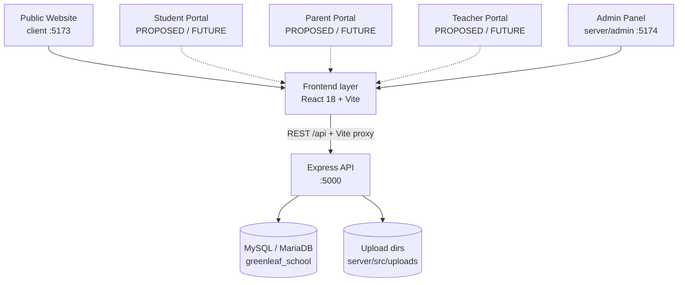

# SYSTEM DESIGN
## Green Leaf International School & College — Technical Architecture

> Companion to `PROJECT_MASTER_PLAN.md` (the development roadmap — MASTER ROADMAP).
> This file is the MASTER TECHNICAL DESIGN. It documents the ACTUAL architecture,
> verified against the codebase on 2026-09-26 and re-validated the same day.
>
> **Convention:** everything marked **CURRENT / VERIFIED** exists in code today.
> Everything marked **PROPOSED / FUTURE** is design-only — it must never be
> presented as existing, and no migration/table/code may be created from the
> PROPOSED sections without a task that updates these documents first.

---

## A. System Overview

Three applications + shared code, one npm-orchestrated monorepo:

| App | Path | Port (dev, strict) | Role |
|---|---|---|---|
| Public website | `client/` | 5173 | React SPA for visitors |
| API server | `server/src/` | 5000 | Express REST API + static upload serving |
| Admin panel | `server/admin/` | 5174 | React SPA for content management |



Both SPAs proxy `/api` to `http://localhost:5000` in dev (Vite `server.proxy`);
in production the reverse proxy or same-origin deployment must provide the
same mapping.

## B. Technology Stack

| Layer | Technology | Notes |
|---|---|---|
| Public frontend | React 18.3, react-router-dom 6.28, Vite 6 | JavaScript/JSX, ESM |
| Admin frontend | React 18.3, react-router-dom 6.28, Vite 6 | Separate app, port 5174 |
| Styling | Tailwind CSS 3.4 + PostCSS + Autoprefixer | Both SPAs |
| API | Node.js ≥18, Express 4.21 | ESM (`"type": "module"`) |
| Database | MySQL 8+ / MariaDB 10.4+ via mysql2 3.24 | utf8mb4_unicode_ci, pool, UTC timezone |
| Auth | bcryptjs 3, zero-dependency HMAC session tokens | No JWT lib by design |
| Security | helmet 8, cors 2, express-rate-limit 7, cookie-parser | |
| Images | sharp 0.35 | Sanitize/re-encode pipeline |
| Logging | morgan (dev only) | No structured logging yet |
| Dev tooling | concurrently, nodemon, ESLint | No test framework yet |
| Shared | `shared/` (config, constants, content, utils) | Imported directly by all three apps (Vite/ESM monorepo resolution) |

## C. Frontend Architecture (Public Website)

### Structure
```
client/src/
├── Components/
│   ├── content/CtaBand.jsx        # reusable-block renderer
│   ├── home/LeadershipMessage.jsx # DB-backed leadership section
│   ├── layout/                    # Layout, Navbar, Footer, SettingsHeadSync
│   └── ui/                        # Button, Card, SectionWrapper, BrandBlock,
│                                  # LoadingSpinner, ErrorMessage, ErrorBoundary
├── Pages/                         # Home, About, Academics, Admissions, Campus,
│                                  # News, NewsDetail, Contact (routed via Layout)
├── context/SettingsContext.jsx    # global settings provider
├── hooks/                         # useNavigation, useNews, useHomeContent,
│                                  # useReusableContent, useScrollReveal, useMarqueeClone
├── services/                      # thin fetch layer per API (news, settings,
│                                  # navigation, leadership, content, home)
├── utils/                         # navigation.js (API→navbar mapping + fallbacks),
│                                  # branding.js (head application)
├── content/homeContentResolver.js # homepage section resolution + fallbacks
└── data/                          # legacy local data (leadershipMessages.js —
                                   # audit note: candidate for removal)
```

### Routing
- `BrowserRouter`; all public routes nested under a single `Layout` route
  (fixed 3-row navbar + footer + page transitions + `SettingsHeadSync`).
- Routes: `/` (HomeContentProvider-wrapped), `/about`, `/academics`,
  `/admissions`, `/campus`, `/teachers` (B.5), `/downloads` (B.6),
  `/gallery` (B.2), `/news`, `/news/:slug`, `/contact`.
- Every indexable page mounts the ONE per-page SEO hook
  (`usePageSeo` — see AG for the metadata/canonical/JSON-LD behavior).
- **CURRENT GAP:** there is NO `*` catch-all route — unknown public URLs render
  the layout with an empty content area (the admin SPA has a `*` fallback; the
  public site does not). Tracked as MASTER_PLAN §20.10, fix in Phase A.

### Data-flow conventions (project rules)
1. **One fetch per concern at the app root** (settings, news, reusable blocks);
   page-scoped fetches only where the data is page-specific (home content).
2. **Services are thin** (`client/src/services/*`); components never fetch.
3. **Every provider carries a built-in fallback** (siteConfig / homeContent
   constants). API failure degrades to fallback or intentional empty states —
   the site never blanks and never renders placeholder content as published data.
4. **Fallback navigation** (`FALLBACK_NAV_ITEMS`) keeps the navbar usable if
   `/api/navigation` fails; malformed API records are skipped defensively.
5. Maps URLs are built only by `shared/utils/mapsUrls.js` from central
   `location` settings (embed + directions; branded placeholder when unset).

### State management
React context + hooks only. No Redux/Zustand. Admin panel has its own local
hooks (`useAdminAuth`) and a fetch wrapper with in-flight GET deduplication.

## D. Backend Architecture

```
server/src/
├── server.js            # app assembly, middleware order, route mounting,
│                        # 404 + global error handler, fail-loud port handling
├── config/db.js         # mysql2 pool (utf8mb4, UTC, no multi-statements)
├── routes/              # 11 route files; public/admin pairs per module
├── controllers/         # HTTP mapping only (no business rules)
├── services/            # business rules + authorization of intent
├── models/              # SQL access (parameterized, named placeholders)
├── validators/          # per-module input validation before services
├── middleware/          # sessionAuth (admin gate), upload (raw body reader),
│                        # adminAuth (deprecated re-export shim)
├── utils/               # sessionToken, cookieSession, errors, imageUpload,
│                        # imageSanitizer, deprecatedAdminToken
└── scripts/             # dbRun.js (migrate/seed/verify/setup), createAdmin.js
```

- **Layering rule:** controller → service → model. Services throw
  `HttpError` (utils/errors.js) with `status`; controllers map to responses.
- **Fail-loud startup:** server exits if `AUTH_SECRET` missing/short (<32 chars);
  port-in-use prints a diagnostic (including "API already running") and exits.
- **DB pool:** `multipleStatements: false`, named placeholders, `timezone: 'Z'`.
- **Known inconsistency (CURRENT):** the news controller returns bare
  `{ items }` / `{ error }` envelopes while every other module uses
  `{ success, message, data }` — tracked as MASTER_PLAN §20.11.

## E. API Architecture

- Base path `/api`. Canonical response envelope: `{ success, message?, data?, items? }`
  (news module deviates — see D).
- Public/admin split per module: public routes are unauthenticated and
  read-only; all `write` routes live under `/api/admin/*` behind `adminAuth`.
- Complete mounted route map (CURRENT / VERIFIED):

| Route | Auth | Purpose |
|---|---|---|
| GET /api/health | public | liveness + environment |
| POST /api/auth/login | public (10/10min limiter) | issue session cookie |
| GET /api/auth/me | admin | live profile (re-reads DB) |
| POST /api/auth/logout | public | clear cookie (idempotent) |
| GET /api/navigation | public | active nav tree (parents + children) |
| GET/POST/PUT/DELETE /api/admin/navigation(/:id) | admin | menu management |
| GET /api/leadership-messages | public | active leadership messages |
| GET /api/leadership | public | combined section + messages payload |
| GET/POST/PATCH/PUT/DELETE /api/admin/leadership-messages(/:id), POST .../image, PATCH /reorder | admin | leadership management + portraits + ordering |
| GET/PUT /api/admin/leadership-section | admin | section settings |
| GET /api/settings | public | effective merged settings |
| GET/PUT /api/admin/settings | admin | settings groups (legacy `contact.address` → 400) |
| GET /api/pages/:page | public | resolved page sections (:page ∈ home/about/academics/campus — B.3) |
| GET /api/admin/pages/:page ; PUT /api/admin/pages/:page/sections/:key | admin | generic section editor (unknown page/key → 404; unknown fields → 400) |
| GET /api/content/blocks | public | active reusable blocks |
| GET/PUT/PATCH/DELETE /api/admin/content/blocks(/:key), PATCH /:key/active | admin | blocks; delete of referenced block → 409 |
| GET /api/news (?type=&limit=&offset=) ; GET /api/news/:slug | public | PUBLISHED only, newest first, `Cache-Control: no-store` |
| GET/POST/PUT/PATCH/DELETE /api/admin/news(/:id), PATCH /:id/status | admin | news lifecycle |
| POST /api/admin/uploads/image | admin (30/15min) | multipart "image" → WebP |
| GET /api/uploads/leadership/:file ; /images/:file | public | sanitized file serving |
| GET /api/gallery (?category=&limit=&offset=) | public | PUBLISHED gallery items, display order |
| GET /api/gallery/categories | public | categories having published items |
| GET/POST /api/admin/gallery | admin | gallery listing / create (→ DRAFT) |
| GET/PUT/DELETE /api/admin/gallery/:id | admin | detail / edit metadata / delete (+ orphan-safe image cleanup) |
| PATCH /api/admin/gallery/:id/status | admin | lifecycle: DRAFT/PUBLISHED/ARCHIVED |
| POST /api/contact | public (global limiter) | contact form submit → contact_messages (NEW) |
| GET /api/admin/contact-messages(?status=) | admin | inbox list, newest first |
| GET /api/admin/contact-messages/:id | admin | one message |
| PATCH /api/admin/contact-messages/:id/status | admin | lifecycle: NEW/READ/REPLIED/ARCHIVED |
| DELETE /api/admin/contact-messages/:id | admin | hard delete (nothing references contact rows) |
| (no identity routes) | — | **Phase C.2**: identity foundation is service-level ONLY — no /api/users or /api/admin/users route exists (verified 404); C4 cutover changes /api/auth internals; /api/admin/users arrives with C6 |

Unknown routes → JSON 404. Errors → `{ success:false, message }` (news: `{error}`);
production 500s are generic (details logged server-side only).

**Contact request/response contract (CURRENT / VERIFIED):**
```
POST /api/contact
  Request body : { name, email, phone?, subject, message }
                 (unknown fields → 400; strings trimmed server-side;
                  email lowercased; phone optional — empty string = NULL)
  201          : { success: true,
                   message: "Your message has been sent. We will get back to you soon.",
                   data: { id, receivedLabel } }   ← no stored content echoed
  400          : { success: false, message }      ← field-level safe messages
  500          : { success: false, message: "..." } ← generic, internals logged only
```
There is intentionally NO public read endpoint for contact messages (`GET
/api/contact` → 404). Reading is admin-only — contact submissions are private
data (see X).

## F. Authentication Architecture

**Admin-only today (CURRENT / VERIFIED).** Flow:

```
Login form (admin SPA)
  → POST /api/auth/login { email, password }
  → adminAuthService.login:
      normalize+validate → findByEmailWithHash
      bcrypt.compare ALWAYS runs (dummy hash for unknown email — timing-safe)
      is_active must be 1
  → createSessionToken(user)  [base64url(payload).HMAC-SHA256(payload, AUTH_SECRET)]
  → Set-Cookie: greenleaf_admin_session; HttpOnly; SameSite=Lax;
     secure in production; maxAge = SESSION_TTL_HOURS (12h)
  → subsequent requests: attachSessionUser middleware verifies the cookie
    (timing-safe signature compare + expiry) and sets req.adminUser
  → adminAuth guard on every /api/admin/* router
```

- Stateless sessions: no server-side session store; expiry is enforced in the
  token payload (`sub`, `email`, `name`, `iat`, `exp`). `/api/auth/me` re-reads
  the admin row so deactivation is effective immediately.
- Transition path (deprecated): `Authorization: Bearer $ADMIN_TOKEN` (server
  secret) accepted for scripts/tests while configured; fail-closed 503 when
  nothing is configured at all.
- Password hashing: bcrypt cost 12; hashes never leave the service module.
- **PROPOSED / FUTURE:** role-aware identities (see RBAC section). The session
  token is role-agnostic; adding a `role` claim is format-compatible.

## G. Authorization / RBAC Strategy

### Current state (CURRENT / VERIFIED)

Exactly one implicit role exists — *authenticated admin*. There is no
roles/permissions table and no role column on `admin_users`.

> **Phase C.2 note (2026-09-27):** the IDENTITY FOUNDATION for future RBAC
> now EXISTS as tables + service layer (`roles` / `users` / `user_roles` /
> `role_permissions` — migrations 013–016, see §AN.3) but NO authentication
> path or middleware reads them yet: the login flow, adminAuth gate and
> session mechanism are UNCHANGED and remain admin_users-based until the
> C4 cutover. `user_roles` is the assignment source future middleware
> consumes; `role_permissions` ships empty by design (enforcement = C7).

Enforcement model:
- Binary gate: `adminAuth` middleware on every `/api/admin/*` router (fail-closed).
- Public routes are read-only and serve only published/active data
  (news status, `is_active` flags) — authorization by data filtering.
- No row-level authorization exists (no per-user data to protect yet).

### Future RBAC strategy (PROPOSED / FUTURE — design only, do not implement yet)

Roles: **Admin · Teacher · Student · Parent/Guardian** (Staff optional, only if
audit-confirmed need arises — e.g. office/accounting staff who need fee or
notice access without teaching duties).

**1. Authentication (evolution of the existing system, not replacement):**
- One `users` table for all identities (id, email, password_hash, name,
  role, is_active, timestamps) reusing the proven admin_users patterns
  (bcrypt-12, unique email, active-only login).
- Migration path for `admin_users`: either (a) migrate rows into `users` with
  role='admin' and keep `admin_users` as a deprecated alias, or (b) keep
  `admin_users` and add `users` only for new roles. Decision deferred to
  Phase C planning; (a) is cleaner long-term, (b) is lower-risk.
- Session token gains a `role` claim (format-compatible; same HMAC scheme).
- Role-aware middleware resolves `req.user = { id, role, profileId }` and the
  existing `adminAuth` becomes `requireRole('admin')` (kept as an alias so no
  existing router breaks).

**2. Authorization (least privilege):**
- `requireRole(...roles)` — coarse gate (replaces the binary gate).
- `requirePermission('students.write')` — fine gate reading role_permissions
  (cached per process with short TTL); admins have `*` until granularity is
  needed.
- Default DENY: any endpoint without an explicit role/permission check stays
  public-read-only or is admin-gated — nothing silently opens.

**3. Role assignment:**
- Admin UI (Phase D): super admins assign roles; only `*`-permission admins
  may create admins. Students/teachers/guardians are created through their
  management modules (Phases F/G/H) with credentials issued by admins
  (no self-registration for portals).

**4. Resource ownership (scoping rules — enforced in services/models, never
by trusting client-supplied ids):**

| Role | May access | Scoping mechanism |
|---|---|---|
| Student | ONLY own records (profile, attendance, results, routine, syllabus, assignments, fees, targeted notices) | `users.id → students.user_id`; every portal query filters by the authenticated student id from the session |
| Parent/Guardian | ONLY linked children's records | `student_guardians` junction verified per request: guardian user id → guardian row → linked student ids → child query filtered to those ids |
| Teacher | ONLY assigned classes/subjects/students | `teacher_assignments` (teacher ↔ class_subject) verified per request; attendance/marks writes restricted to the assigned class-subject |
| Admin | Management according to permissions | role_permissions; `*` until granularity needed |

**5. Permission checks in practice (portal examples):**
- `GET /api/portal/student/attendance` → session must be role=student → query
  `WHERE student_id = sessionStudentId`.
- `GET /api/portal/guardian/child/:studentId/attendance` → verify
  `student_guardians` contains (sessionGuardianId, :studentId) → then query.
- `POST /api/portal/teacher/attendance` → verify the class is in the teacher's
  `teacher_assignments` → then write.
- All three deny with generic 403/404 (never confirm the existence of records
  the caller cannot access).

**6. Admin access:** unchanged binary behavior today; Phase D adds granularity.
Existing `/api/admin/*` routers keep working via the `requireRole('admin')` alias.

## H. Database Architecture

CURRENT / VERIFIED:

- **Engine:** MySQL 8+ / MariaDB 10.4+ (XAMPP-compatible), database
  `greenleaf_school` (`DB_NAME`), charset `utf8mb4` / `utf8mb4_unicode_ci`.
- **Migrations:** plain SQL files `server/sql/migrations/001–016`, run by
  `src/scripts/dbRun.js` (`npm run db:migrate`), tracked in a
  `schema_migrations` table (applied once per DB, transactional per file,
  deterministic filename order, dedicated multi-statement connection for the
  tracked repo files only). `{{DATABASE_NAME}}` placeholder is substituted
  from env. Seeds run the same way into `schema_seeds`.
- **Seeds:** `server/sql/seeds/001–006` (7 navigation items, leadership
  section shell — NO fabricated identities, 24 site settings, home sections,
  admissions CTA block, 4 identity role catalog rows — Phase C.2).
- **Data-safety rules baked into migrations:** no fabricated identities,
  CHECK constraints duplicate ENUM validation for non-strict MariaDB servers,
  FKs RESTRICT parent deletion with children, unique keys are case-insensitive
  via collation.
- **Access:** all queries via the shared pool with parameterized named
  placeholders; no dynamic SQL concatenation (LIMIT/OFFSET are integer-clamped,
  never string-interpolated from input).

## I. Database Entity Relationship Overview

CURRENT / VERIFIED entities:

```mermaid
erDiagram
    ADMIN_USERS {
        int id PK
        varchar email UK
        varchar password_hash
        varchar name
        tinyint is_active
    }
    NAVIGATION_ITEMS {
        int id PK
        int parent_id FK
        varchar title
        varchar slug UK
        varchar url
        enum type
        int sort_order
        tinyint is_active
    }
    LEADERSHIP_SECTIONS {
        int id PK
        varchar eyebrow
        varchar title
        text description
        tinyint is_active
    }
    LEADERSHIP_MESSAGES {
        int id PK
        int section_id FK
        varchar role
        varchar name
        varchar title
        text message
        varchar image_url
        varchar image_alt
        int sort_order
        tinyint is_active
    }
    SITE_SETTINGS {
        int id PK
        varchar setting_key UK
        text setting_value
        varchar setting_group
    }
    PAGE_SECTIONS {
        int id PK
        varchar page
        varchar section_key
        int sort_order
        json content
        tinyint is_active
    }
    CONTENT_BLOCKS {
        int id PK
        varchar block_key UK
        varchar name
        varchar block_type
        json content
        tinyint is_active
    }    NEWS_ITEMS {
        int id PK
        varchar title
        varchar slug UK
        varchar type
        varchar status
        varchar excerpt
        text content
        varchar image
        datetime published_at
    }
    GALLERY_ITEMS {
        int id PK
        varchar title
        varchar caption
        varchar image
        varchar category
        varchar status
        int sort_order
    }
    CONTACT_MESSAGES {
        int id PK
        varchar name
        varchar email
        varchar phone
        varchar subject
        text message
        varchar status
    }

    NAVIGATION_ITEMS ||--o{ NAVIGATION_ITEMS : "parent_id (RESTRICT)"
    LEADERSHIP_SECTIONS ||--o{ LEADERSHIP_MESSAGES : "section_id (RESTRICT)"
    ```

Real foreign keys (CURRENT): the two shown above. Everything else is a soft
reference:
- `page_sections.content` may reference `content_blocks.block_key` by
  convention (`{ "__block": "admissions-primary-cta" }`) — service-enforced
  (delete-protection 409), not FK.
- `news_items.image`, `leadership_messages.image_url` store public
  `/api/uploads/...` paths (soft reference to files, not rows).

## J. Core Database Entities

Format: Entity — Purpose — PK — key fields — FK — constraints/indexes —
related API — related frontend. All CURRENT / VERIFIED.

### navigation_items
- Purpose: hierarchical navbar (main menu + one submenu level).
- PK `id`; FK `parent_id → navigation_items.id` ON DELETE RESTRICT.
- Fields: title, slug (unique, nullable for dropdown parents), url, type
  ENUM(INTERNAL/EXTERNAL/DROPDOWN), sort_order, is_active, open_new_tab, icon.
- Constraints: CHECK title non-empty, CHECK type whitelist, idx(parent_id, sort_order).
- API: GET /api/navigation; admin CRUD /api/admin/navigation.
- Frontend: Navbar (desktop dropdowns + mobile), utils/navigation.js mapping.

### leadership_sections
- Purpose: homepage Leadership Message section copy (eyebrow/title/description).
- PK `id`; fields: eyebrow, title, description, is_active.
- Single-section setup (seed 002 creates one row; service creates if missing).
- API: GET/PUT /api/admin/leadership-section; included in GET /api/leadership.

### leadership_messages
- Purpose: Principal/Chairman/any-role message cards on the Homepage.
- PK `id`; FK `section_id → leadership_sections.id` ON DELETE RESTRICT
  (migration 004; backfilled to the first section).
- Fields: role (unique within section — service-enforced), name, title,
  message, image_url, image_alt, sort_order, is_active.
- Constraints: CHECK role non-empty, CHECK sort_order ≥ 0,
  idx(is_active, sort_order), idx(section_id, sort_order). Ships with NO
  message seed data (no fabricated identities).
- API: public list + combined payload; admin CRUD + PATCH reorder + POST image.
- Frontend: Home → LeadershipMessage (2×2 grid with "pending" placeholders).

### admin_users
- Purpose: admin login identities.
- PK `id`; unique email; fields: password_hash (bcrypt), name, is_active.
- Constraints: idx(email, is_active).
- API: /api/auth/*.
- Frontend: admin LoginPage/useAdminAuth.

### site_settings
- Purpose: admin-editable global settings, one row per dotted key
  (identity.*, branding.*, contact.*, social.*, location.*, seo.*).
- PK `id`; unique setting_key; idx(setting_group); 24 seeded keys.
- API: public GET merged; admin GET/PUT.
- Frontend: SettingsContext → Navbar/Footer/Contact/Home/Head sync.

### page_sections
- Purpose: admin-editable page sections as validated JSON blobs per section.
- PK `id`; UNIQUE (page, section_key); idx(page, sort_order). `page` is a
  free VARCHAR(50) — new page values need NO migration; the per-section
  fallback covers a missing row and rows are created on first admin save.
- Page identifiers (Phase B.3): `home` {hero, newsPreview, lifeAtSchool,
  videoShowcase, admissionsCta (a `{ "__block": "admissions-primary-cta" }`
  reference)}, `about` {intro, coreValues, visionMission}, `academics`
  {overview, programs, environment, academicsCta}, `campus` {overview,
  facilities, galleryHighlight — heading copy ONLY, photos stay in
  gallery_items}.
- API: GET /api/pages/:page (resolved, per-section fallback, DB-down → full
  fallback); admin GET + PUT per section (per-section schema validation,
  unknown pages/sections → 404, unknown fields → 400).
- Frontend: useHomeContent → Home; usePageContent(page) +
  shared/content/{about,academics,campus}Content.js fallbacks →
  About/Academics/Campus. Sections with isActive:false are hidden by the
  public pages; block-reference sections resolve to null when hidden.

### content_blocks
- Purpose: reusable content managed once, referenced by key.
- PK `id`; unique block_key; fields: name, block_type ('CTA' today), content
  JSON (per-type validated schema), is_active.
- API: public GET; admin GET/PUT/PATCH active/DELETE (+ referenced-block
  delete → 409 naming consumers).
- Frontend: useReusableContent → CtaBand (Home + Admissions pages).

### gallery_items
- Purpose: public photo gallery (Phase B.2) — the DB-backed source for the
  Campus gallery grid and the `/gallery` page. Rows store ONLY a safe public
  image reference; image bytes live in the managed uploads directory.
- PK `id`; no FK. Fields: title(150), caption(500, nullable — alt text),
  image(500 — `/api/uploads/images/<file>` or legacy `/Activity/…` path),
  category(50, validator-constrained list: Academic Events / Sports / Cultural
  Programs / Science Fair / Educational Tour / School Events / Campus / Other),
  status (DRAFT/PUBLISHED/ARCHIVED — the news vocabulary, reused), sort_order,
  created_at, updated_at.
- Constraints: CHECK title non-empty, CHECK status whitelist, CHECK
  sort_order ≥ 0, idx(status, sort_order), idx(category). NO seed data.
- Upload flow: the admin form uses the EXISTING `ImageUploader` → shared
  endpoint `POST /api/admin/uploads/image` (magic bytes → sharp WebP →
  server-generated filename); the gallery payload carries only the returned
  safe path. No new upload surface was created.
- Public/private separation: public API serves PUBLISHED rows projected to a
  safe shape (`id, title, caption, image, category`) — status, sort_order and
  timestamps never leave the server; DRAFT/ARCHIVED rows are never exposed.
- Deletion safety: hard delete + orphan-safe cleanup — the managed file is
  unlinked only when NO other gallery row AND no news row references it
  (shared images directory); legacy paths are never touched; cleanup failures
  never fail the request.
- API: GET /api/gallery (?category=&limit=&offset=) + GET /api/gallery/categories;
  admin CRUD + status behind adminAuth.
- Frontend: public `/gallery` page (category chips from the categories
  endpoint, aspect-square boxes against layout shift, lazy loading, hover
  captions) + Campus gallery grid (DB-backed with the verified hardcoded
  images as visible fallback while no published items exist).

### contact_messages
- Purpose: public Contact form submissions; admin-managed private inbox
  (Phase B.1).
- PK `id`; no FK. Fields: name, email (service lowercases), phone (NULL — the
  form treats it as optional), subject, message (TEXT), status
  (NEW/READ/REPLIED/ARCHIVED), created_at, updated_at.
- Constraints: CHECK name/subject non-empty, CHECK status whitelist,
  idx(status, created_at). NO seed data (messages arrive from real visitors).
- API: POST /api/contact (the ONLY public path — insert-only, acknowledge-only,
  never echoes content); admin list/detail/status/delete behind adminAuth.
- Frontend: public Contact form (submit + loading/success/server-error states,
  duplicate-submit guard); admin Contact Inbox (`/contact-inbox` — list,
  status filter tabs, detail view, mark read/replied, archive/unarchive,
  two-click delete confirm).
- Dates stored UTC; served as ISO 8601 + `receivedLabel` fixed to Asia/Dhaka
  (same convention as news `dateLabel`).

### news_items
- Purpose: the ONE dynamic news/notice/event/announcement source.
- PK `id`; unique slug; fields: title, type (NEWS/NOTICE/EVENT/ANNOUNCEMENT),
  status (DRAFT/PUBLISHED/ARCHIVED), excerpt, content, image, published_at.
- Constraints: idx(status, published_at), idx(type). Dates stored UTC, served
  as ISO 8601 + preformatted `dateLabel` (Asia/Dhaka fixed). Validators
  enforce bounded title/excerpt/content, slug format, type/status whitelists,
  and reject unknown fields.
- API: public list (?type=&limit=&offset= / detail (PUBLISHED only); admin
  CRUD + status patch. Server stamps `published_at` (never client-supplied).
  Public `?type=` is VALIDATED (unknown → 400, B item 4); `?upcoming=true`
  (B item 4) serves PUBLISHED EVENT items only, requires a derived future
  `eventDate`, sorted chronologically — a projection of the SAME rows (no
  parallel source). Event date source of truth: the item content's
  `Event Date: YYYY-MM-DD` first line (admin date picker serializes it);
  lists expose the derived `eventDate` WITHOUT content bodies; missing
  dates are excluded from upcoming (TBA-safe).
- Frontend: NewsProvider → Navbar ticker, Home preview, News page (type
  filter chips + Upcoming Events view), /news/:slug.

## K. Important Relationships

CURRENT (all soft except the two real FKs):

| Relationship | Mechanism |
|---|---|
| navigation_items → navigation_items (parent) | real FK, RESTRICT |
| leadership_messages → leadership_sections | real FK, RESTRICT (migration 004) |
| gallery_items → uploaded files | soft: `/api/uploads/images/...` path (deletion is shared-file-safe across gallery + news) |
| contact_messages | standalone entity — nothing references it (safe hard delete) |
| page_sections → content_blocks | soft: `content.__block` = block_key (service-enforced, 409 on referenced delete) |
| news_items / page_sections / site_settings / content_blocks → uploaded files | soft: public `/api/uploads/...` path strings |
| settings ↔ consumers | runtime resolution via SettingsContext (fallback siteConfig) |
| news ↔ UI surfaces | single NewsProvider consumption (no data copies) |

PROPOSED (future portal/academic relationships — see L).

## L. Database Expansion Strategy (CURRENT vs PROPOSED)

### CURRENT DATABASE (verified — do not modify without a documented task)
`admin_users`, `navigation_items`, `leadership_sections`, `leadership_messages`,
`site_settings`, `page_sections`, `content_blocks`, `news_items`,
`contact_messages` (migration 010, Phase B.1), `gallery_items` (migration 011,
Phase B.2), `downloads` (migration 012, Phase B.6), `roles` / `users` /
`user_roles` / `role_permissions` (migrations 013–016, Phase C.2 identity
foundation — see §AN.3/§AN.13; NOT yet read by any authentication path:
cutover is C4)
(+ runner tracking tables `schema_migrations`, `schema_seeds`).

Rules: additive idempotent migrations only; no table/column renames without a
strong documented reason; no migrations are created now — this section is
documentation only.

### PROPOSED DATABASE (none of this exists — documentation only)

For each entity: purpose · relationships · dependency · reuse-or-new ·
migration required?

| Entity | Purpose | Relationships | Dependency | Reuse / New | Migration? |
|---|---|---|---|---|---|
| `users` | unified identity for all roles (email, password_hash, name, role, is_active) | 1:1 with role-profile tables; session token carries user id + role | Phase C; replaces nothing immediately (admin_users migration path decided in Phase C) | NEW (admin_users may be migrated in, not reused as-is — it lacks `role`) | Yes |
| `roles` / `permissions` / `role_permissions` | RBAC catalogs; role_permissions maps roles→permission keys | roles 1:N role_permissions; users.role → roles.code | Phase D, after `users` | NEW | Yes |
| `students` | student records (roll no, name, DOB, class/section enrollment, user_id link) | N:1 users (identity); N:1 classes+sections; 1:N attendance/results/fees | Phase F; needs C (users) + E (classes) | NEW | Yes |
| `guardians` | guardian records + user_id link | N:1 users; M:N students via `student_guardians` | Phase F (schema) / H (UI); needs C, F | NEW | Yes |
| `student_guardians` | guardian↔student link (relationship type, is_primary) | junction table | with guardians | NEW | Yes |
| `teachers` / `employees` | staff records + user_id link | 1:N teacher_assignments | Phase G; needs C + E | NEW | Yes |
| `classes` / `sections` / `subjects` / `class_subjects` | academic structure (e.g. Class VI / A / Mathematics; class_subjects maps subjects to classes) | classes 1:N sections; class_subjects (class, subject) | Phase E (no auth dependency beyond admin CRUD) | NEW | Yes |
| `teacher_assignments` | teacher ↔ class_subject (+ section, role: class-teacher/subject-teacher) | N:1 teachers; N:1 class_subjects | Phase G; THE authorization source for I/J/K/N | NEW | Yes |
| `academic_calendar` / `holiday_list` | year calendar + holidays (date, title, type) | standalone (optionally class-scoped later) | Phase E | NEW | Yes |
| `class_routines` / `exam_routines` | periodic + exam schedules (day/period/subject/room or exam/date/time) | N:1 classes/sections/exams | Phase J; needs E (+K for exam_routines) | NEW | Yes |
| `syllabi` / `weekly_syllabi` | per class-subject syllabus; weekly breakdowns | N:1 class_subjects | Phase J; needs E, G | NEW | Yes |
| `assignments` / `questions` / `answers` | homework + question bank (WT questions/answers) | N:1 class_subject + teacher; questions 1:N answers | Phase J; needs E, G | NEW | Yes |
| `exams` / `marks` / `results` / `merit_lists` | exam cycles (WT/half-yearly/annual), per-student subject marks, published results, merit lists | exams 1:N marks; marks N:1 (student, exam, class_subject); results per student+exam | Phase K; needs F, G, J | NEW | Yes |
| `attendance` / `leave_requests` | daily per-student status; leave workflow (applied/reviewed) | N:1 students + class + date; leave N:1 student, reviewed by teacher/admin | Phase I; needs E, F, G | NEW | Yes |
| ~~`users` / `roles` / `user_roles` / `role_permissions`~~ | **DONE (Phase C.2)** — now CURRENT (migrations 013–016; see §AN.3/§AN.13): canonical identity + role catalog + multi-role junction + permission-key map. NO authentication path reads them yet (cutover C4); permission enforcement C7 | users ← user_roles → roles ← role_permissions | Phase C (done) | SHIPPED | 013–016 |
| `notice_targets` | role-targeted notices (news_items extension: role/audience column or junction) | N:1 news_items | Phase N; may extend news_items (reuse!) rather than a new entity if a simple `audience` column suffices | REUSE news_items + additive column, or NEW junction for multi-target | Yes |
| `admission_applications` | online applications (applicant info, class applied, status workflow) | N:1 classes | Phase L; needs E | NEW | Yes |
| `fee_structures` | PUBLIC fee definitions per class/type | N:1 classes | Phase M (public part independent) | NEW | Yes |
| `student_fees` / `payments` / `invoices` | PRIVATE per-student ledger, payments, receipts | N:1 students; N:1 fee_structures | Phase M; needs F | NEW | Yes |
| ~~`downloads`~~ | **DONE (Phase B.6)** — now CURRENT (see the Downloads architecture section): title/description/category/managed file reference/original_filename/file_ext/file_bytes/status/sort_order; DB-mediated secure serving | standalone; document uploads reuse the shared admin upload surface (POST /api/admin/uploads/document — PDF branch) | Phase B (done) | SHIPPED | migration 012 |
| ~~`contact_messages`~~ | **DONE (Phase B.1)** — now CURRENT (see J for the verified entity) | standalone | — | SHIPPED | migration 010 |
| ~~`gallery_items`~~ | **DONE (Phase B.2)** — now CURRENT (see J); image uploads REUSE the shared pipeline (no new upload surface) | standalone | Phase B (done) | SHIPPED | migration 011 |
| `audit_logs` | privileged-action trail (actor, action, entity, entity_id, meta, ip, at) | N:1 users | Phase D | NEW | Yes |
| `password_resets` | expiring reset tokens (user_id, token_hash, expires_at) | N:1 users | Phase C | NEW | Yes |

Reuse rules for PROPOSED entities:
- **Reuse `news_items`** for notices/events — never create a parallel notices
  entity; add targeting additively if/when needed (Phase N).
- **Reuse the image pipeline** (`/api/admin/uploads/image` + uploads routes)
  for any new image fields (gallery, student/teacher photos, committee).
- **Reuse the news status-lifecycle pattern** (DRAFT→PUBLISHED→ARCHIVED with
  server-stamped timestamps) for results publication and application review.
- ~~**Reuse `page_sections`** for new public pages~~ — **DONE (Phase B.3)**:
  About/Academics/Campus DB-backed via page identifiers `about`/`academics`/
  `campus` (no new tables, no migration)
  — new `page` values, not new tables.
- Do NOT extend `admin_users` into an all-role table (it lacks `role`; new
  `users` table is cleaner) — final decision in Phase C.

## M. API Route Structure

Route files (CURRENT, server/src/routes): `authRoutes`, `navigationRoutes`,
`adminNavigationRoutes`, `leadershipRoutes` (+ exported admin router),
`settingsRoutes` (+ admin), `pageSectionRoutes` (+ admin), `contentBlockRoutes`
(+ admin), `newsRoutes` (named exports public/admin), `uploadsRoutes`,
`adminUploadRoutes`, `contactRoutes` (+ exported `adminContactRouter`),
`galleryRoutes` (+ exported `adminGalleryRouter`), `downloadRoutes` (+ exported
`adminDownloadRouter`) (**Phase B.6**).
Mounting lives in `server.js` (see E table). Conventions:

- Public router first, admin router second, both under `/api`.
- Admin routers `use(adminAuth)` before any handler.
- Controllers never contain SQL; models never format HTTP responses.

PROPOSED (future; naming follows the established public/admin pairs):
`/api/contact` + `/api/admin/contact-messages`,
`/api/teachers(/admin)`, `/api/academics/*`,
`/api/admissions/*`, `/api/fees/*`, `/api/students(/admin)`, and
`/api/portal/{student|guardian|teacher}/*` for role-scoped portal reads/writes
(ownership scoping inside services — see RBAC section).

## N. Service Layer Architecture

Services (CURRENT): adminAuthService, navigationService, leadershipService,
siteSettingsService, pageSectionService, contentBlockService, newsService,
contactService, galleryService, downloadService (**Phase B.6** — owns the
published-only gate, safe public projection and orphan-safe managed-file
cleanup; serving resolution via `resolvePublishedDownloadFile`). Rules:

- Own all business rules (validation-adjacent checks, fallbacks, slug
  generation/collision suffixes, status transitions, delete-protection,
  role-uniqueness within a leadership section).
- Throw `HttpError` subclasses (badRequest/notFound/conflict/unauthorized).
- Are the ONLY callers of models; controllers map errors → responses.
- Site settings service merges DB rows over `siteConfig.js` and never serves
  the retired `contact.address` key.
- PROPOSED evolution: portal services receive the session identity and apply
  ownership scoping before any model call.

## O. Middleware

| Middleware | File | Role |
|---|---|---|
| helmet | server.js | security headers |
| cors | server.js | origin allowlist + credentials |
| morgan('dev') | server.js | request logging (NODE_ENV=development only) |
| express.json/urlencoded (10mb) | server.js | body parsing |
| cookieParser | server.js | session cookie parsing |
| attachSessionUser | sessionAuth.js | verify cookie → req.adminUser (global) |
| jsonBodyErrorHandler | sessionAuth.js | malformed JSON → safe 400 (global) |
| adminAuth | sessionAuth.js | admin gate on /api/admin/* (fail-closed 503/401) |
| global limiter | server.js | 600 req/15min per admin-identity-or-IP on /api/* (login exempted) |
| loginLimiter | authRoutes.js | 10 attempts/10min on POST /api/auth/login |
| uploadRateLimit | adminUploadRoutes.js | 30 uploads/15min |
| readImageUpload | upload.js | streaming 10 MB cap + multipart "image" extraction |
| 404 handler / global error handler | server.js | JSON errors; prod-safe messages |

PROPOSED (Phase D/N): `requireRole(...roles)`, `requirePermission(key)`,
ownership-scoping helpers — evolved from `adminAuth`, which becomes an alias
for `requireRole('admin')` so no existing router breaks.

## P. File Upload Architecture

CURRENT / VERIFIED:

```
Browser (admin ImageUploader)
  → POST /api/admin/uploads/image   multipart, single part "image"
  → adminAuth (before body read) → uploadRateLimit
  → readImageUpload: content-type check → content-length precheck
    → streaming 10 MB cap (destroys socket on excess)
    → extract single "image" part (byte-preserving latin1 parse)
  → saveImage: magic-byte allowlist (JPEG/PNG/WebP)
    → sharp: failOn error, limitInputPixels 24MP, metadata dimension check
      (6000×6000 max) → rotate (EXIF normalize) → strip metadata → WebP q82
  → write to server/src/uploads/images/<ts36>-<12 random hex>.webp
     (server-generated filename; browser name NEVER used → no traversal)
  → 201 { image_path: "/api/uploads/images/<file>", width, height, bytes }
```

- Serving: `GET /api/uploads/{leadership|images}/:file` with strict filename
  regex (`[A-Za-z0-9._-]+`, no `..`) + resolved-path containment check.
- Deleting: only managed paths can be unlinked; missing files count as success;
  news/leadership services delete replaced images only when no other row
  references them (shared-file safety).
- Leadership portraits use the same pipeline with a dedicated directory/prefix.
- Directory contents are gitignored; only sanitizer output ever exists there.
- **DONE (Phase B.6 downloads)**: the same validation/containment pattern now
  also covers a documents directory — `utils/documentUpload.js` (PDF-only
  allowlist + `%PDF-` magic-byte check, same server-generated-filename rule,
  same 10 MB cap, strict resolver + refuse-outside-root deletion). Document
  upload endpoint: `POST /api/admin/uploads/document` (same adminAuth gate,
  same raw-body middleware, same dedicated upload limiter as images). The
  image branch is untouched. See the Downloads architecture section.

### P.1 Downloads architecture (Phase B.6 — CURRENT / VERIFIED)

One entity, one admin flow, one public Center. Source of truth: the `downloads`
table (migration 012, idempotent, additive).

**Schema (migration 012):** `id`, `title` VARCHAR(200) NOT NULL,
`description` VARCHAR(500) NULL, `category` VARCHAR(50) NOT NULL DEFAULT 'Other'
(controlled vocabulary), `file` VARCHAR(500) NOT NULL (SAFE managed reference —
NEVER a client path), `original_filename` VARCHAR(255) NULL (display-only,
sanitized), `file_ext` VARCHAR(10) NULL ('pdf'), `file_bytes` INT UNSIGNED NULL,
`status` VARCHAR(20) DEFAULT 'DRAFT' (DRAFT | PUBLISHED | ARCHIVED),
`sort_order` INT DEFAULT 0, `created_at`/`updated_at`. Indexes:
(status, sort_order) for the public list, (category) for filters, (file) for
orphan-safe shared-file cleanup. No FKs (standalone, mirrors news/gallery).

**Upload pipeline (document branch):** `POST /api/admin/uploads/document` —
SAME adminAuth gate + same dedicated upload limiter (30/15 min) + same raw-body
middleware as images, but the DOCUMENT branch (`utils/documentUpload.js`):

- PDF-only extension allowlist; `assertRealPdf` magic-byte check (`%PDF-`) —
  client-declared MIME is never trusted; HTML/exe renamed `.pdf` → 400.
- 10 MB cap enforced twice (streaming in middleware, then in `saveDocument`).
- Server-generated filenames (`<ts36>-<24 hex>.pdf`); browser filename NEVER
  touches the filesystem → traversal impossible by construction.
- Storage: `server/src/uploads/documents/` (gitignored, sanitizer/pipeline
  output only). Response: `{ file_path: "/api/uploads/documents/<name>",
  bytes, original_filename, file_ext }` — note `file_path` is a MANAGED
  REFERENCE (the DB column), NOT a static-served URL.
- The image endpoint (`POST /api/admin/uploads/image`) and its sharp/WebP
  branch are UNTOUCHED.

**Stored reference validation (defense in depth):** `validateDownloadFile`
accepts ONLY `/api/uploads/documents/[A-Za-z0-9.-]+.pdf` — rejects traversal,
backslashes, `%`-encoding, absolute URLs, other managed namespaces, double
extensions. A client can never point a row at an arbitrary file.

**File serving (DB-mediated, `GET /api/downloads/:id/file`):**
request → strict digits-only id parse → DB row lookup → PUBLISHED-only gate
(DRAFT/ARCHIVED answer 404 like unknown ids) → managed reference → strict
resolver confinement (`resolveDocumentPath`: prefix + filename regex + no `..`
+ resolved-path containment, double-checked) → `stat` exists check (missing
file → safe 404 + server-side log, no filesystem leak) → stream via
`res.sendFile` → headers: `Content-Type: application/pdf` (server-determined,
never user MIME), `Content-Disposition: attachment; filename="<sanitized>"`
(CR/LF/quotes/control-chars stripped — no header injection, no inline
rendering), `X-Content-Type-Options: nosniff`, `Cache-Control: no-store`.
There is deliberately NO `/api/downloads/files/:filename` route and the
`/api/uploads/*` static routes serve ONLY leadership + images directories —
documents are reachable ONLY through the DB-mediated id route.

**Public API:** `GET /api/downloads` (PUBLISHED only, safe projection — no
status/sort_order/timestamps; `?category=` validated against the controlled
vocabulary, `?limit=`≤100/`?offset=` integer-clamped), `GET /api/downloads/categories`
(non-empty categories only). Cache-Control: no-store.

**Admin API (adminAuth):** `GET/POST /api/admin/downloads`,
`GET/PUT/DELETE /api/admin/downloads/:id`, `PATCH /api/admin/downloads/:id/status`.
Unknown fields rejected; create defaults to DRAFT.

**Replacement/deletion:** replacement validates + stores the new file first,
updates the DB, THEN cleans up the old managed file only when no other row
references it (gallery shared-file convention; missing files = success;
cleanup failures never fail the request). Deletion removes the row first, then
the file under the same rule.

**Rate limiting:** document uploads share the dedicated upload limiter
(30/15 min); public file serving is intentionally NOT additionally limited
beyond the global API limiter (600/15 min, identity-aware) — downloads are
normal high-traffic public reads.

**Fallback behavior:** API failure/empty list → public page renders honest
empty state (no fabricated files); missing/malformed physical reference → safe
404 + server log; unknown/invalid id → 404 with a fixed message.

**Verified:** `scripts/test-downloads-api.mjs` — 80 checks covering the full
chain (admin upload → validation → safe storage → DB reference → publish →
public list → secure serving → byte-exact download) plus the 18-point
security checklist.

## Q. CMS Architecture

Content categories (enforced convention, see docs/CONTENT_ARCHITECTURE.md):
1. **Global** → `site_settings` (single source per key; groups surfaced in Site
   Settings admin page).
2. **Reusable blocks** → `content_blocks` (referenced by `block_key`; consumers
   resolve via `useReusableContent().getBlock(key)`; inactive/missing → shared
   defaults; referenced blocks cannot be deleted).
3. **Page-specific** → `page_sections` JSON per section (Homepage + **Phase
   B.3: About / Academics / Campus** — page identifiers `about`, `academics`,
   `campus`; no new tables, no migration needed).
4. **Transactional/dynamic** → dedicated entity tables (`news_items`,
   `gallery_items`, `downloads` (**Phase B.6**); PROPOSED contact — note
   contact_messages shipped in B.1) — NEVER merged into settings/blocks.
5. **Static-first pages** (B.5): content with no DB entity yet ships as a
   shared content module with honest empty states — currently the public
   `/teachers` directory (`shared/content/teachersStaffContent.js`, EMPTY
   people groups until the school supplies verified data; no fabricated
   records). Migration path: Phase G `teachers`/`employees` tables →
   `/api/teachers` maps 1:1 onto the existing person-card shape — no UI
   rewrite.

Admin panel module map (CURRENT): Navigation, Leadership, Site Settings,
Homepage, About Page / Academics Page / Campus Page (one generic
PageContentManagement editor — B.3), Content Center (Location & Map +
Reusable Content + News & Notices), Gallery, Contact Inbox, Downloads
(**Phase B.6** — PDF upload via the shared document branch, CRUD + publish
lifecycle + delete confirmation; file METADATA only in the UI, never paths).

## R. Public Website Architecture

- SPA with DB-driven content and config fallbacks (see C).
- Content consumers: Settings (all pages), HomeContent (Home),
  PageContent (About/Academics/Campus — B.3), ReusableContent (Home +
  Admissions CTAs), News (Navbar/Home/News), Navigation (Navbar),
  Leadership (Home + /teachers directory cards — B.5), Gallery (Campus
  grid + /gallery page), TeachersStaff static-first content (/teachers —
  B.5; empty verified-data groups, honest empty states; person shape
  {id, name, designation, department?, subject?, profile?, image?} is
  the 1:1 seam for the future Phase G `/api/teachers`).
- Static/hardcoded content today (CURRENT): homepage Academics preview only
  (About/Academics/Campus copy DB-backed — Phase B.3; heroes remain
  code-structure by design).
- Contact form (CURRENT): wired to POST /api/contact — client validation +
  submitting/success/server-error states + duplicate-submit guard; server
  re-validates everything; submissions persist to `contact_messages`.
- Gallery (CURRENT, Phase B.2): new `/gallery` page (useGallery →
  GET /api/gallery; category chips; aspect-square boxes prevent layout shift;
  lazy loading; hover captions). The Campus gallery grid is DB-backed with
  the verified hardcoded images as a VISIBLE FALLBACK while no published
  items exist (documented integration decision — fallback-first, same
  convention as navigation). Homepage: no gallery section added (the
  homepage architecture has no gallery slot; MASTER PLAN §11 rule — no
  redesign without explicit requirement).
- Missing catch-all 404 route (CURRENT gap; Phase A).

## S. Student Portal Architecture

**PROPOSED / FUTURE — nothing exists.** Target shape:

- Role-aware authenticated area: either an authenticated `/portal` route area
  within the existing SPA (shared Layout) or a role-aware variant — decision
  deferred to Phase N planning; backend-first: identity tables (C) + data
  modules (E–M) + portal API.
- All portal endpoints under `/api/portal/*` with ownership-scoped handlers
  (session identity → row-owner check inside services/models — see RBAC
  section for the exact check patterns).
- Student reads: profile, attendance, routine, syllabus, assignments, results,
  fees, targeted notices (MASTER_PLAN §7 checklist).

## T. Parent Portal Architecture

**PROPOSED / FUTURE.** Same portal shell as S; guardian accounts link to N
students via `student_guardians`; per-child data switcher in UI; the server
verifies the guardian↔child link on EVERY request before serving any child
data (never trust the client-supplied child id alone).

## U. Teacher Portal Architecture

**PROPOSED / FUTURE.** Same portal shell; authorization driven by
`teacher_assignments` rows (teacher ↔ class_subject ↔ section). Attendance
entry, marks entry, assignment/syllabus management restricted to assigned
scopes; class teachers may see full class rosters, subject teachers only their
subject rows.

## V. Admin Architecture

- Separate Vite SPA (`server/admin`), cookie-session auth via `useAdminAuth`
  + `AuthGate` wrapper on every route; 401/503 from any page → global logout;
  429 shows Retry-After countdown; in-flight GET dedupe guards the rate limit.
- Modules (CURRENT): see PROJECT_MASTER_PLAN §10. `shared/config/siteConfig.js`
  supplies branding; catch-all `*` route redirects to dashboard/login.
- Admin API client: `server/admin/src/services/api.js` fetch wrapper
  (`credentials: 'include'`, normalized `{status, message, retryAfterMs}` errors).
- Account creation is script-only today (`npm run admin:create`, interactive or
  CLI flags) — PROPOSED admin user management UI in Phase C.

## W. Notification Architecture

**None exists** (no email/SMS/webhooks anywhere in the codebase).
**PROPOSED / FUTURE:** in-app notifications table + optional email adapter for
contact-form alerts, published-notice targeting, and portal events. Contact
form delivery is the first consumer (Phase B).

## X. Public vs Private Data

The controlling rule: **private data is never exposed through public APIs**;
all private reads/writes require authentication AND ownership/role scoping.

### PUBLIC (unauthenticated, read-only)
- School identity, branding, contact info, social links, location/map
- School history / about content / mission & vision (once published)
- Facilities, infrastructure
- Teacher public profiles (directory) — name, designation, subject, photo,
  qualification, message — NOT personal contact details
- Academic calendar, holiday list, class routines (per class), exam routines,
  public syllabus (per class)
- Notices, news, events, announcements (PUBLISHED only)
- Gallery, video showcase
- Admission information, fee STRUCTURES (rates), downloadable public documents
- Leadership messages

### AUTHENTICATED / PRIVATE (never public)
- Student personal information (address, DOB, guardian details, documents)
- Student attendance records
- Student results / marks / report cards / academic progress
- Student fees: dues, payments, invoices, receipts
- Student/parent portal notices targeted to roles
- Teacher management data (salary-class fields, personal contacts, documents)
- Marks entry and all academic write operations
- Guardian↔child linkage data
- Administrative data: admin accounts, roles/permissions, audit logs,
  contact-message inbox, admission applications (until public result release)
- Uploaded student/guardian documents

Enforcement today: public endpoints serve only published/active rows
(status/is_active filtering) and there is no private data in the database yet —
the public/private split becomes enforceable the moment the first private
entity (students) is created in Phase F, which is why RBAC (Phase D) must
precede it.

## Y. Future Data Privacy Requirements

**PROPOSED / FUTURE — mandatory before/with Phase F (students).** These apply
to student PII, guardian information, attendance, academic results, fees,
uploaded documents, and all portal traffic.

1. **Student PII:** collect minimally; store only what operations require;
   never render PII in public payloads; per-role field selection in API
   responses (teachers see academic fields, not contacts, unless assigned).
2. **Guardian information:** guardian identity and contact data are private;
   visible only to admins and (in scoped form) the linked teacher(s).
3. **Attendance:** readable only by the student (self), linked guardians,
   assigned teachers, admins; aggregate/anonymized stats may be public only if
   explicitly designed.
4. **Academic results:** hidden until the publication workflow flips status
   (reusing the news DRAFT→PUBLISHED pattern); then visible only to
   self/guardians/assigned staff/admins; merit lists publish names/ranks only
   with school policy approval.
5. **Fees:** ledger data is strictly private; receipts are student/guardian-
   scoped downloads; no financial data in public responses.
6. **Uploaded documents:** stored under the managed upload pipeline with
   server-generated filenames; private documents (student records) served only
   through authorization-checked endpoints — NEVER by guessing public URLs;
   EXIF stripped; antivirus scanning evaluated before student documents launch.
7. **Access logging / audit trail:** `audit_logs` (actor, action, entity, id,
   meta, ip, timestamp) for every privileged write and every private-data read
   class; access-log review procedure documented with deployment (Phase Q).
8. **Authorization:** least-privilege per the RBAC section; default deny;
   generic 403/404 denials that never confirm existence of inaccessible records.
9. **Secure sessions:** cookie `secure` in production (already implemented),
   HTTPS enforced, session TTL bounded, immediate deactivation effect via
   /me-style re-reads; evaluate server-side revocation list for portals.
10. **Rate limiting:** extend identity-aware limiting to portal endpoints
    (per-user buckets already supported by the global limiter's keyGenerator);
    stricter caps on document downloads and marks queries.
11. **Validation:** all portal inputs through the established validators layer
    (whitelisted fields, bounded lengths, server-stamped timestamps — the
    client never supplies published_at/status semantics).
12. **Audit trails:** immutable audit rows (no updates/deletes via API);
    retention policy defined at Phase Q.

## Z. Security Architecture

CURRENT / VERIFIED layers:
1. **Transport/dev:** strict CORS allowlist, credentials-only cookies; dev
   tunnels restricted to `.trycloudflare.com` hosts (client Vite).
2. **Headers:** helmet defaults.
3. **AuthN:** bcrypt-12, timing-safe comparisons (dummy-hash login, HMAC
   signature, Bearer token), HttpOnly + SameSite=Lax cookies (secure in
   production), server-side TTL, immediate deactivation effect via /me
   re-read, fail-closed 503.
4. **AuthZ:** binary admin gate + public read-only data filtering. The contact
   API adds the first insert-only public surface: public callers can never read
   stored messages (GET /api/contact → 404); inbox reads/writes are adminAuth-only.
5. **Rate limiting:** identity-aware global limiter, strict login limiter,
   dedicated upload limiter (all with standard headers).
6. **Input:** per-module validators (unknown fields rejected), strict body
   handling (parse errors → 400), filename regexes, path containment checks.
7. **Uploads:** content-based validation (magic bytes + sharp decode),
   re-encode to WebP (EXIF/polyglot stripping), server-generated names,
   decompression-bomb + dimension + size caps, time-boxed processing.
8. **SQL:** parameterized queries only; `multipleStatements:false`; LIMIT/OFFSET
   integer-clamped.
9. **Errors:** generic production messages; internals logged server-side only.

Known gaps (deliberate, pre-portal; tracked MASTER_PLAN §15/§20): no CSRF
tokens, no lockout, no audit log, no password reset, single admin role.
PROPOSED additions per §Y (privacy) and MASTER_PLAN Phase P.

## AA. Validation Strategy

- **Server (CURRENT):** `server/src/validators/` per module
  (navigation, leadership, settings, pageSection, contentBlock, news) — run
  BEFORE services; reject with safe 400s; unknown fields rejected. DB CHECK
  constraints backstop (non-empty strings, whitelisted types, non-negative
  sort orders) so non-strict MariaDB servers cannot silently coerce bad ENUMs.
- **Client (public, CURRENT):** contact form field validation (required +
  email format).
- **Client (admin, CURRENT):** form-level checks + server error surfacing via
  Feedback components; image uploader pre-validates extension/size before upload.
- **Content shapes (CURRENT):** per-section / per-block-type JSON schemas
  enforced in validators (invalid admin payloads never reach the DB).
- PROPOSED: shared validator primitives extracted when portal entities arrive;
  schema-level (zod-style) validation evaluated in Phase P if validator growth
  demands it.

## AB. Error Handling

CURRENT:
- Canonical envelope: `{ success:false, message }` on every error path
  (news module deviates with `{error}` — MASTER_PLAN §20.11). The contact API
  uses the CANONICAL envelope on both success and error paths.
- `HttpError(status, message)` from services → controller mapping; unknown
  errors → logged + generic 500 (prod) / real message (dev).
- Body-parser syntax errors → 400 via `jsonBodyErrorHandler`.
- 404 JSON for unknown API routes; SPA router fallback exists on admin but is
  missing on the public site (MASTER_PLAN §20.10).
- Frontend: providers degrade to fallback/empty states; admin pages react to
  401/503/429; ErrorBoundary wraps the public app root.

## AC. Rate Limiting

| Limiter | Scope | Window | Max | Key |
|---|---|---|---|---|
| Global | `/api/*` (login exempt) | 15 min | 600 | `user:<adminId>` when session cookie valid, else `ip:<req.ip>` |
| Login | POST /api/auth/login | 10 min | 10 | IP |
| Upload | POST /api/admin/uploads/image | 15 min | 30 | IP |

`POST /api/contact` is intentionally covered by the GLOBAL limiter only (no
redundant second limiter); a burst of 40 rapid submissions was verified safe
(all accepted below threshold, limiter armed for higher rates).

- `trust proxy = 1` so proxied dev traffic gets real client IPs (prevents the
  shared-loopback-bucket problem documented in server.js).
- Standard draft-7 headers (`RateLimit-*`, `Retry-After`); admin UI surfaces
  Retry-After.
- PROPOSED: portal endpoints join the global identity-aware bucket
  (`user:<id>` already works for any authenticated identity); public
  write endpoints (contact form) get their own stricter limiter.

## AD. Logging / Monitoring

- morgan 'dev' in development only; `console.error` for server-side faults.
- No structured logging, no APM, no uptime monitoring yet.
- **PROPOSED:** structured logs, request ids, health-based monitoring at
  deployment time (Phase Q).

## AE. Caching

- **CURRENT:** public news GETs send `Cache-Control: no-store` (correctness for
  a CMS-updated feed); all other GET endpoints and `/api/uploads/*` send NO
  cache headers (tracked MASTER_PLAN §20.12). No server-side caching layer.
- Client-side: single-fetch providers + admin GET dedupe are the effective
  "cache" for session scope; no SWR/persisted cache.
- **PROPOSED:** `Cache-Control: public, max-age` + immutable semantics on
  uploads (filenames are already content-unique); ETag/short-TTL cache on
  settings/navigation; revalidation strategy for news.

## AF. Performance Strategy

CURRENT: lazy images, fetchPriority hero, WebP conversion, one-fetch
providers, Vite build with sourcemaps, strict ports (no port-scan flapping).
PROPOSED: route-level code splitting, upload cache headers, skeleton loading,
DB query review when academic data scales (indexes already defined for the hot
public queries).

## AG. SEO Architecture (Phase B.7 — CURRENT / VERIFIED)

One SEO layer, three shared building blocks, no competing implementations:

| Building block | File | Role |
|---|---|---|
| Route inventory + origin resolution | `shared/config/seoConfig.js` | `SEO_ROUTES` (the 10 static indexable paths + changefreq/priority), `SEO_DISALLOWED_PATHS`, `getSiteUrl()` (`SITE_URL` → `CLIENT_URL` → `siteConfig.seo.siteUrl`, may be null), `buildCanonicalUrl()` |
| JSON-LD builders | `shared/utils/seoJsonLd.js` | `buildOrganizationSchema` / `buildWebSiteSchema` / `buildNewsArticleSchema`, `toJsonLdScriptContent` (escapes `<`) — verified-data-only |
| Sitemap XML assembly | `server/src/utils/sitemapXml.js` | Pure `buildSitemapXml()` / `xmlEscape()` — no-origin → EMPTY urlset |

**Per-page metadata (one mechanism).** Every indexable page calls
`usePageSeo({ title, description, path, item?, ogType?, ogImage? })`
(`client/src/hooks/usePageSeo.jsx`) → `applyPageSeo()`
(`client/src/utils/branding.js`), which owns ALL head writes for the page:
title (org name appended), meta description, canonical link, `og:title/`
`description/type/url/image`, Twitter card set, and the page's JSON-LD
scripts (marked `data-seo-page`). Unmount runs `restoreGlobalSeo` —
navigation leaves zero page-scoped tags behind. The global
`SettingsHeadSync` (settings arrival) is guard-integrated: while a page
SEO effect is mounted (`isPageSeoActive()`) it syncs NOTHING page-owned
(title/description/OG — including og:type/og:image); it only applies
branding when no page owns the head, so the DB settings overlay can never
stomp a mounted page's metadata. No other file writes `document.title`.

**Route inventory (verified against `client/src/App.jsx`):** `/` Home,
`/about`, `/academics`, `/admissions`, `/campus`, `/teachers`,
`/downloads`, `/gallery`, `/news`, `/news/:slug` (dynamic), `/contact`
— 11 routed pages, all indexable, each with a unique intentional title +
description via `usePageSeo`. NO public catch-all route exists yet
(§20.10/§AM.2); unknown paths render the layout — they carry NO canonical
and are NOT in the sitemap, so they cannot create duplicate URLs.

**Canonical strategy.** Canonical = `getSiteUrl()` + stable route path.
Origin resolution is explicit: `SITE_URL` (production) → `CLIENT_URL`
(dev convenience) → `siteConfig.seo.siteUrl` fallback (null). NO origin →
client omits canonical/og:url entirely (no relative URLs, no invented
origin) and the server serves an EMPTY sitemap urlset without a robots
`Sitemap:` line — localhost is never hardcoded. Filtered views are
canonicalized to the hub: `/news?type=…` and `/news?upcoming=true` pages
declare canonical `/news` (News.jsx uses the fixed path) and query strings
never enter the sitemap — no duplicate-URL farming. News detail canonical
= the item's own `/news/<slug>` (slug is the stable unique key).

**robots.txt** (`GET /robots.txt`, server routes `server/src/routes/
seoRoutes.js` mounted at `/`): `User-agent: *` + `Disallow:` for
`/admin`, `/api`, `/login`, `/dashboard` (from `SEO_DISALLOWED_PATHS`);
`Sitemap:` line only when an origin resolves; `Cache-Control: public,
max-age=3600`. Public pages/assets are never blocked (uploads live under
`/api/uploads` — intentionally disallowed from crawling but not from
rendering; images render client-side regardless).

**sitemap.xml** (`GET /sitemap.xml`): the 10 static routes from
`SEO_ROUTES` + one URL per PUBLISHED news item (slugs via
`findPublishedNewsSlugs` — `WHERE status='PUBLISHED'` enforced in SQL, so
DRAFT/ARCHIVED rows can never appear; capped at 5000; DB failure →
static routes only, never a 500). URLs are absolute
(origin-resolved), deduplicated, query-free, XML-escaped, with the
protocol-correct no-origin behavior above. Vite dev proxies
`/robots.txt` + `/sitemap.xml` to :5000 so both resolve on the public
dev origin; production must map them to the API (same reverse proxy
that maps `/api`).

**JSON-LD (conservative-by-design).** Emitted per page by `usePageSeo`:
- `EducationalOrganization` — name, url, logo, description, address,
  telephone, sameAs — each property ONLY when verified (placeholder
  strings like `[Phone Number]`, empty values, and non-https URLs are
  omitted; no invented postal code/geo/opening hours/ratings).
- `WebSite` — name + url.
- `NewsArticle` (detail pages with a loaded published item) — headline,
  description (excerpt), image, datePublished/dateModified,
  mainEntityOfPage, publisher (org name). Built ONLY from the public
  detail payload (the endpoint serves PUBLISHED rows only — drafts can
  never reach the builder).
- Event schema: deliberately NOT implemented — the news `Event Date:`
  line provides a date but no verified venue/location data exists.
  Revisit with venue data.
- BreadcrumbList: deliberately NOT implemented — no breadcrumb UI
  exists in the current routes (schema must mirror visible UI).

**Dynamic News detail SEO.** Loading/not-found/API-failure states render
NEUTRAL metadata ("News" title + `/news` canonical + no article schema);
only a successfully fetched published item swaps in its own title,
excerpt, image, dates, `og:type=article`, canonical `/news/<slug>` and
NewsArticle JSON-LD. DRAFT/ARCHIVED/nonexistent slugs are 404 at the API
layer, so unpublished content can never leak through metadata, OG tags,
JSON-LD, or the sitemap (all verified by the test script's live probe).

**Social metadata.** OG tags per page (title/description/type/url/image)
+ Twitter `summary_large_image` card (card/title/description/image).
Images: news item image when present, else the global OG image
(settings `branding.ogImage`), absolutized against the resolved origin
(omitted when relative without origin).

**SPA indexing limitation (honest statement — no SSR introduced).**
This is a React 18 + Vite SPA: metadata is set at RUNTIME. Any crawler
that executes JavaScript (Google, Bing, modern social scrapers that run
headless browsers) receives the full per-page metadata. Crawlers or
unfurlers that read only the static HTML see `client/index.html`'s
fallback title/description on every route — dynamic news titles/OG
images will NOT be visible to them. This is the accepted Phase B trade
-off; server-side route fallback/prerendering for `/news/:slug` remains
a future evaluation (MASTER PLAN §16), NOT part of B.7. No SSR was
introduced.

**Verification:** `scripts/test-seo-api.mjs` — 70 checks: robots
validity/allowlist, sitemap validity + hygiene (absolute URLs, no
api/admin/query URLs, no duplicates, origin resolution, empty-urlset
rule, escaping), JSON-LD builder guarantees (verified-data-only,
placeholder omission, script-escape safety), getSiteUrl precedence,
live draft/archived/deleted/nonexistent sitemap-leak probes (via admin
API), and repo wiring (all 11 pages use the ONE hook; no competing
`document.title` writes; og-stomp guard in place).

## AH. Deployment Architecture

- Dev (CURRENT): `npm run dev` (concurrently: client 5173, server 5000,
  admin 5174), Vite proxies `/api` → 5000, strict ports with fail-loud
  diagnostics.
- Temporary public demo (CURRENT): Cloudflare quick tunnel per
  docs/LOCAL_PUBLIC_ACCESS.md (browser → tunnel → client Vite → proxy → API;
  DB/uploads never exposed).
- Production (planned): Node ≥18, PM2 + Nginx reverse proxy + Let's Encrypt;
  build client+admin (`npm run build`), serve static bundles, proxy `/api` to
  Express, set real DB_*/AUTH_SECRET/CLIENT_URL/ADMIN_URL. Note:
  docs/DEPLOYMENT.md env-var names are stale (JWT_SECRET) — AUTH_SECRET is the
  real contract (MASTER_PLAN §20.2).
- **PROPOSED (Phase Q):** managed MySQL with automated backups, object storage
  or persistent volume for uploads, health-check restarts, staged env configs.

## AI. Environment Variables

Actual contract (CURRENT — server/.env, see server/.env.example):

| Variable | Required | Purpose |
|---|---|---|
| PORT | no (5000) | API port (fixed, never drifts) |
| NODE_ENV | no (development) | dev logging + error verbosity; secure cookies in production |
| CLIENT_URL | no (http://localhost:5173) | CORS origin |
| ADMIN_URL | no (http://localhost:5174) | CORS origin |
| DB_HOST / DB_PORT / DB_NAME / DB_USER / DB_PASSWORD | dev fallbacks exist (XAMPP root) | database connection |
| DB_CONNECTION_LIMIT | no (10) | pool size |
| AUTH_SECRET | **YES** (≥32 chars; server refuses to start) | session HMAC secret |
| SESSION_TTL_HOURS | no (12) | session lifetime |
| ADMIN_TOKEN | no (deprecated) | Bearer transition secret for scripts |

`shared/config/siteConfig.js` is application branding (NOT env config) and is
safe to commit; `server/.env` is gitignored. Known doc defects: stray
`[TEMPLATE]` lines at the top of `.env.example` (§20.8); stale JWT names in
docs/DEPLOYMENT.md (§20.2).

## AJ. Backup / Recovery

- **None automated (CURRENT).** Migrations are re-runnable (`db:setup` =
  migrate+seed) and seeds re-create baseline content; uploads directories are
  gitignored (not backed up).
- **PROPOSED (Phase Q):** nightly `mysqldump` + upload-dir sync, restore
  runbook, retention policy, restore testing.

## AK. Testing Strategy

- CURRENT: manual scripts (`scripts/test-leadership-api.mjs`,
  `test-image-upload.mjs`, `lm-manual-tests.cjs`) hitting a running API; ESLint
  with `--max-warnings 0` in all three packages. No automated tests.
- **PROPOSED:** Vitest unit tests (validators/services first), supertest
  integration suites per router, Playwright E2E for public flows + admin
  login, CI running lint+tests. Start in Phase P ramp — validators first —
  not after all features.

## AL. Future Scalability

- Stateless API + stateless sessions → horizontal scale is straightforward;
  session revocation via the deactivation check is the current trade-off.
- MySQL pool + indexed hot queries are adequate for a single-school workload;
  read replicas unnecessary at current scale.
- Uploads to object storage (S3-compatible) would decouple app servers from
  local disk if multi-instance deployment becomes needed.
- Role model (PROPOSED) must be designed before portal traffic so that
  ownership scoping is enforced in services (not bolted on).

## AM. Known Architectural Limitations

1. **SPA-only rendering** — metadata is applied at RUNTIME (`usePageSeo`,
   Phase B.7): JS-executing crawlers get full per-page metadata, but
   static-HTML-only crawlers see the index.html fallback on every route;
   no SSR/prerender yet (deliberate — see AG for the honest breakdown).
2. **No public 404 route** — unknown URLs render an empty layout (Phase A fix).
3. **Hand-rolled multipart parser** — single-file scope only; replace if
   multi-file or field-rich uploads arrive.
4. **Stateless sessions cannot be individually revoked** server-side (logout
   clears the cookie; token remains valid until TTL) — mitigated by 12h TTL and
   immediate deactivation checks; acceptable until portals demand revocation
   lists.
5. **No CSRF tokens** — SameSite=Lax + JSON content-type are the current
   mitigations; revisit before portal state-changing flows.
6. **Single implicit admin role** — no granularity; Phase C/D design work
   precedes any portal phase.
7. **Soft references (block/image paths) are not FK-enforced** — integrity is
   service-layer enforced (delete-protection); orphan cleanup is partial
   (generic-image orphan handling exists).
8. **Deprecated shims** (adminAuth re-export, ADMIN_TOKEN Bearer, legacy local
   leadership data file) remain for compatibility — removal items tracked in
   MASTER_PLAN §21.
9. ~~**Contact form has no backend**~~ — **RESOLVED (Phase B.1)**: full flow
   shipped and verified (`scripts/test-contact-api.mjs`, 48 checks green).
10. **Hardcoded page copy** — PARTIALLY RESOLVED (**Phase B.3**):
    About/Academics/Campus page sections are DB-backed via `page_sections`
    (verified, `scripts/test-page-sections-api.mjs`, 57 checks green); the
    homepage Academics preview remains hardcoded (tracked in MASTER_PLAN §20.4).
11. **No automated tests** — regression safety currently depends on lint +
    manual scripts only.
12. **Response-envelope inconsistency** in the news module (MASTER_PLAN §20.11).

## AN. Authentication & Identity Architecture — Phase C Design

> **STATUS: AUDIT + DESIGN (C1, 2026-09-27); identity foundation (C2)
> IMPLEMENTED 2026-09-27; ownership/linking seams (C3) IMPLEMENTED
> 2026-09-27; AUTHENTICATION CUTOVER (C4) IMPLEMENTED + LIVE-VERIFIED
> 2026-09-28.** CURRENT / VERIFIED: §AN.1, §AN.3 (models/service/
> validator), §AN.13 tables 1–4, and the C4 cutover surface — §AN.7
> claims + pwdAt invalidation, §AN.9 Origin/Referer baseline, §AN.10
> email identifier, §AN.14 copy + gate + users-canonical login (all
> verified by `scripts/test-c4-cutover.mjs`, 55/55, live server + DB).
> Everything else in this section (§AN.5 permission keys beyond the
> empty table, §AN.8 password reset, §AN.11 future endpoints, §AN.12
> future limit values, §AN.15–AN.18) remains **PROPOSED / FUTURE**.
> Where this section refines earlier PROPOSED notes (G, L), THIS
> section is authoritative.

### AN.1 Current state (CURRENT / VERIFIED)

**Login flow (verified live):** `POST /api/auth/login` {email, password} →
`adminAuthService.login()` normalizes (trim+lowercase email), looks up
`admin_users` by exact email, runs `bcrypt.compare` ALWAYS (dummy hash for
unknown emails — timing-safe), requires `is_active = 1`, and issues a
zero-dependency HMAC-SHA256 session token
(`base64url(payload).base64url(HMAC-SHA256(payload, AUTH_SECRET))`, payload
`{ sub, email, name, iat, exp }`, TTL 12h from `SESSION_TTL_HOURS`) set as
HttpOnly cookie `greenleaf_admin_session` (SameSite=Lax, secure in
production, path=/). Failures: generic 401 `Invalid email or password.`;
malformed JSON → safe 400; `ADMIN_TOKEN` Bearer remains as a deprecated
transition path for scripts (fail-closed 503 when nothing is configured).

**Validation & logout:** `GET /api/auth/me` re-reads the live admin row
(deactivation/deletion takes effect immediately); `POST /api/auth/logout`
clears the cookie idempotently (no server-side session store exists).

**Authorization:** single implicit role (authenticated admin). Binary
fail-closed `adminAuth` gate on every `/api/admin/*` router; public routes
are read-only with status/is_active data filtering. No 403 paths exist —
denials are 401 (unauthenticated) or 404/400 (data-level).

**Database identity model (verified):** 13 tables; the ONLY identity table
is `admin_users` (id PK; email UNIQUE case-insensitive; password_hash
bcrypt; name; is_active; timestamps; idx(email, is_active)). **NO users,
roles, permissions, sessions or password-reset tables exist.** No
`user_id`-style column exists anywhere (the only `parent_id` fields are
navigation/leadership hierarchy). No entity represents a non-admin person.
Verified rows: 3 admin accounts (including real personal data — migration
must be non-destructive).

**Frontend (admin SPA):** `useAdminAuth` (no token in JS — HttpOnly cookie
only; /me restores session on refresh) + `AuthGate` per route + shared
`handleUnauthorized` (401/503 → logout) + fetch wrapper with
`credentials: 'include'`, GET dedupe, 429 Retry-After surfacing. The
public site has ZERO auth code.

**Security controls (verified):** helmet, CORS allowlist (5173/5174,
credentials), global limiter 600/15min identity-aware (login exempt),
login limiter 10/10min, upload limiter 30/15min, bcrypt-12, timing-safe
compares, parameterized SQL (`multipleStatements:false`), fail-loud
AUTH_SECRET (≥32 chars), generic prod errors.

### AN.2 Identity gap summary (drives the design)

1. One identity table (`admin_users`) with no role concept — cannot host
   students/teachers/guardians (schema has no role, and its name/semantics
   are admin-specific).
2. No RBAC: every admin is equal; no permission granularity (blocks
   least-privilege before student data arrives — MASTER_PLAN Phase D gate).
3. No password reset / recovery (no email delivery either).
4. Stateless sessions cannot be revoked server-side (mitigated by 12h TTL
   + /me re-read; acceptable until portals demand revocation lists).
5. No CSRF tokens (SameSite=Lax + JSON content-type are the mitigations).
6. Deprecated shims remain (adminAuth re-export, ADMIN_TOKEN Bearer).

### AN.3 Unified identity model (Phase C.2: NOW IMPLEMENTED — CURRENT / VERIFIED)

Definitions:
- **USER** — one authenticated identity: `users` row (email = login
  identifier, bcrypt password_hash, name, is_active, password_changed_at).
  **CURRENT (migration 014; C4 cutover 2026-09-28): the authentication
  source — login and /me read users (§AN.14).**
- **ROLE** — a seeded catalog code (`roles`: admin, student, teacher,
  guardian — seed 006) that carries a permission set via `role_permissions`.
  **CURRENT (migrations 013/016).**
- **PROFILE** — a DOMAIN entity linked 1:1 by `user_id` (students Phase F,
  teachers/employees Phase G, guardians Phase F/H). **PROPOSED / FUTURE.**
- **ACCOUNT** — the users row + its role assignments; lifecycle via
  is_active.

`users.password_changed_at` (UTC, NULL = never) powers password-change
session invalidation (AN.7) **CURRENT since the C4 cutover**:
`attachSessionUser` compares the token `pwdAt` against the live stamp
(mismatch → 401) at zero ongoing cost; copied admin rows are stamped at
the copy time.

**C2 code (CURRENT / VERIFIED — service-level only, NO HTTP surface):**
models `server/src/models/{Role,User,UserRole,RolePermission}.js`
(parameterized SQL; password_hash never leaves the model),
`server/src/services/identityService.js` (createUser with bcrypt-12 +
primary-role transaction; assignRole with makePrimary swap; read-only
role catalog; short-TTL permission cache),
`server/src/validators/identityValidation.js` (email/name/role-code/
permission-key whitelists, unknown fields rejected).
Verified by `scripts/test-identity-foundation.mjs` (49 checks: structure,
uniques, FK CASCADE/RESTRICT rules, catalog seed, service rules incl.
duplicate/invalid rejection + transaction safety, privacy, admin
compatibility, CASCADE cleanup).

### AN.4 Role architecture (PROPOSED — supersedes the users.role mention in §L)

**`users` + `roles` (catalog) + `user_roles` (junction) — NOT a single
role column.** Reasons: (a) teacher-who-is-also-guardian and
admin-who-is-also-teacher are realistic in a school and the junction
admits them with zero migration; (b) role_permissions keys off roles, so
a second role would otherwise duplicate permission rows; (c) the portal
shell (Phase N) needs a deterministic default — solved with
`user_roles.is_primary` (exactly one per user, service-enforced).
Service rules: every user has ≥1 role; exactly one is_primary.

### AN.5 Permission architecture (PROPOSED)

RBAC with a seeded permission-key catalog — no per-user overrides in
v1. `role_permissions(role_id, permission_key VARCHAR(64))`; the key
whitelist lives in code (mirrors the existing validator-whitelist
convention). Middleware evolution: `requireRole(...codes)` (coarse,
replaces the binary gate; `adminAuth` becomes an alias so no router
breaks) and `requirePermission('students.write')` (fine, reads
role_permissions cached per process with short TTL). Coarse defaults:
`admin` → `*`. Per-user allow/deny overrides: deferred (documented
extension point).

### AN.6 Ownership / data-scoping rules (PROPOSED — the portal contract)

Enforcement LAYERING (backend only, never frontend hiding):
| Layer | Responsibility |
|---|---|
| middleware `attachSessionUser` | verify signature/expiry → `req.user = { id, roleCodes }` |
| middleware `requireRole` / `requirePermission` | coarse gate (401/403) |
| **service** | OWNERSHIP: resolve session identity → profile id(s) via user_id lookup, then scope every model call to it |
| model | parameterized SQL with the scoped id in WHERE — never a client-supplied id |

Patterns: student → `users.id → students.user_id` → own rows only;
teacher → `teacher_assignments` (verified per request) → assigned
class-subjects only; guardian → `student_guardians` verified per request
→ linked children only; admin → permission-scoped. Denials: generic 403
or 404 that never confirm the existence of inaccessible records.
`GET /api/portal/...` endpoints never accept an owner id from the client
body/URL as authorization input.

> **C3 note (2026-09-27):** the pattern layer above is NOW CODE —
> `server/src/services/ownershipScoping.js` implements the deterministic
> primitives (canonical `users.id` parsing/domain, session-identity
> ownership resolution where a client-supplied id can only CONFIRM the
> session identity, owned-row double-checks, parameterized owned-by WHERE
> fragments, active-identity resolution through the C2 safe projection).
> Denials return `null` (caller maps to generic 404 — 403 stays a C7
> concern). The helpers NEVER authenticate, never read cookies, never
> gate permissions, and never project credentials; verified by
> `scripts/test-ownership-scoping.mjs` (64 checks incl. C3/C4 boundary
> scans + live-DB round-trips). Middleware/profile tables that CONSUME
> these helpers remain future work (C4 cutover, C8, Phases F/G/H).

### AN.7 Session strategy (PROPOSED extensions to the WORKING mechanism)

KEEP: stateless HMAC token, HttpOnly+Lax+secure cookie, 12h TTL, /me
re-read. EXTEND (format-compatible):
- payload gains `roles: [codes]` (read at login from user_roles) and
  `pwdAt` (users.password_changed_at at issue time);
- `attachSessionUser` additionally compares token `pwdAt` vs the live
  `users.password_changed_at` → mismatch = 401 (password-change
  invalidation WITHOUT a session store);
- session FIXATION: cookie value is regenerated on every login (already
  true); per-request rotation deferred;
- concurrent sessions: allowed; per-device listing/revocation deferred
  to Phase P (revocation-list evaluation before portals).
- logout: cookie clear (client-side) — unchanged; server-side
  invalidation = password-change rule + future revocation list.

### AN.8 Password reset design (PROPOSED — Phase C5)

`password_resets` (id PK; user_id FK CASCADE; token_hash CHAR(64) =
SHA-256 of a 32-byte crypto-random token; expires_at (60 min);
used_at NULL; created_at; idx(token_hash), idx(user_id)). Flow:
request → create token (store HASH only; email the raw token once) →
reset consumes: hash-match + unexpired + unused (transactional UPDATE
with used_at check) → sets password_hash + password_changed_at=NOW →
invalidates all other reset rows for the user. Generic responses
(no account enumeration). Rate limit 5/15min per IP + per email on the
request endpoint. **Email delivery does not exist (§W):** until the
notification adapter ships, password reset is ADMIN-ISSUED (C6 UI
generates a one-time set-password link/token shown to the admin) + the
existing `admin:create` script path; self-service email reset activates
automatically when the email adapter lands. Login rate limit unchanged.

### AN.9 CSRF analysis (PROPOSED decision — no library now)

Current exposure: cookie-authenticated state-changing endpoints.
Mitigations already in place: SameSite=Lax (blocks cross-site POST
cookies in modern browsers), JSON-only bodies (simple-form CSRF cannot
send application/json), strict CORS allowlist. Decision: ADD cheap
Origin/Referer validation middleware for `/api/auth/*` and
`/api/admin/*` state-changing routes at Phase C4 (reject when an Origin
header is present and not allowlisted); full double-submit CSRF tokens
re-evaluated in the Phase P review when portal forms arrive. No library
in Phase C.

### AN.10 Login identifier & lifecycle (PROPOSED)

- Canonical identifier: **email** (lowercase, unique). Existing
  convention end-to-end; phone stays display-only (contact settings);
  NO username, NO second identifier.
- Lifecycle: `is_active` (ACTIVE/INACTIVE) is SUFFICIENT. No PENDING
  (no self-registration — accounts are issued), no LOCKED (rate
  limiters cover brute force), no SUSPENDED (policy distinction, not
  technical). Do not add a status column.

### AN.11 API boundaries & response contract (PROPOSED)

| Group | Boundary | Auth |
|---|---|---|
| `/api/health`, public content | unchanged | none |
| `/api/auth/*` | login/logout/me (+ future change-password, forgot/reset) | mixed: login/forgot public; me/change authenticated |
| `/api/admin/*` | admin CMS + future `/api/admin/users` | `requireRole('admin')` (adminAuth alias) |
| `/api/portal/{student\|guardian\|teacher}/*` | ownership-scoped reads/writes (Phase N) | role + ownership scoping (AN.6) |

Response contract: the CANONICAL `{ success, message?, data }` envelope
everywhere (the news `{items}` deviation exists and is tracked §20.11 —
never replicated). 401 = no/expired/invalid session; 403 = authenticated
but not permitted (introduced with requireRole/requirePermission);
422-style validation stays 400 with safe messages.

### AN.12 Rate limits (PROPOSED future values)

| Endpoint | Limit | Key |
|---|---|---|
| POST /api/auth/login | 10/10min (EXISTS) | IP |
| POST /api/auth/forgot-password | 5/15min | IP + per-email (double bucket) |
| POST /api/auth/reset-password | 10/15min | IP |
| change-password, me, logout | global limiter only (600/15min, identity-aware) | user:id / ip |

### AN.13 Database entities (Phase C.2: 013–016 IMPLEMENTED — CURRENT / VERIFIED; 017 future)

| Order | Table | Purpose / key columns | FKs | Privacy | Status |
|---|---|---|---|---|---|
| 1 | `roles` (013) | catalog: id, code UNIQUE, name, is_active; seeds: admin/student/teacher/guardian | — | low | **CURRENT (C.2)** |
| 2 | `users` (014) | id, email UNIQUE (ci), password_hash, name, is_active, password_changed_at, timestamps; idx(email,is_active) | — | HIGH (credentials) | **CURRENT (C.2)** — no auth path reads it yet |
| 3 | `user_roles` (015) | user_id FK CASCADE, role_id FK RESTRICT, is_primary TINYINT; UNIQUE(user_id,role_id), idx(user_id), idx(role_id) | users, roles | medium | **CURRENT (C.2)** |
| 4 | `role_permissions` (016) | role_id FK CASCADE, permission_key VARCHAR(64); PK(role_id, permission_key) | roles | low | **CURRENT (C.2)** — no rows; enforcement C7 |
| 5 | `password_resets` (017, Phase C5) | as AN.8 | users | HIGH | PROPOSED |

Migrations are additive/idempotent per the established runner (proven:
applied twice — second run 0 applied). Profile
tables (students/teachers/guardians + assignments + student_guardians)
remain Phase F/G/H per the existing plan — Phase C creates the SEAMS
(user_id conventions + AN.6 patterns), not the tables. C2 shipped the
service-level foundation; **C4 (2026-09-28) made `users` the live
authentication source** — still NO identity HTTP surface (GET /api/users
→ 404 re-verified; /api/admin/users arrives with C6). Live DB after the
copy: users = 3 canonical admins (email/verbatim-hash/active-state
1:1 with admin_users, stamped password_changed_at), each with exactly
one primary `admin` role; admin_users = 3 rows byte-identical
(read-only legacy, kept forever).

### AN.14 Admin compatibility strategy (phased, non-destructive — C4 phase IMPLEMENTED 2026-09-28)

Adopt **users as canonical identity** (Strategy B from the strategy
comparison: separate-forever would fork password reset/user
management/audit forever; link-forever would keep dual lookups in every
auth path) — implemented in phases so nothing breaks:
1. **C2 (no data movement):** create roles/users/user_roles/
   role_permissions; admin_users untouched; login still reads admin_users.
2. **C4 (cutover) — IMPLEMENTED 2026-09-28:** one-time non-destructive
   copy script (`server/src/scripts/migrateAdminUsersToUsers.js`,
   `npm run identity:migrate-admins`; `--verify-only` = gate only) — each
   admin_users row → users (+ user_roles admin, is_primary) WITH its
   existing bcrypt hash (bcrypt hashes are portable; NO plaintext,
   NO re-hash, NO password change for admins; created_at preserved;
   password_changed_at stamped at the copy). Login switches to users;
   admin_users becomes a read-only legacy table (kept, never dropped).
   `/api/auth/me` switches to users; `roles` + `pwdAt` claims added to
   tokens (§AN.7). Session identity flows through the LONG-ESTABLISHED
   `req.adminUser` consumer shape with CANONICAL values (id = users.id)
   — no router/CMS changes. Post-cutover `admin:create` creates
   CANONICAL admins (users + primary admin role via the C2 identity
   service) so script-created accounts can log in; a same-email legacy
   row would surface as a copy-gate CONFLICT (audited, never merged).
3. **Verification gate (mandatory, IMPLEMENTED):** the copy script's gate
   re-reads BOTH tables fresh and asserts SOURCE/TARGET counts,
   MISSING/DUPLICATE/CONFLICT/INVALID/EXTRA reporting, verbatim hashes,
   active-state mapping, stamped password_changed_at, exactly-one primary
   `admin` role per copied identity, mechanical wrong-password bcrypt
   rejection (proves hash processability without plaintext), no orphan
   user_roles, no duplicate canonical email; exits NON-ZERO on any
   failure — the cutover must not be activated unless it passes.
   Rollback = previous server code (tables are additive; admin_users
   never modified).
4. **Retirement:** deferred until Phase C exit is verified; removal of
   the deprecated shims (adminAuth path, ADMIN_TOKEN) is a separate
   tracked cleanup, never bundled.

### AN.15 Frontend auth boundaries (PROPOSED)

Shared (future, when portals exist): fetch wrapper conventions
(credentials include, error normalization, Retry-After), session
bootstrap via /me-style endpoint, AuthGate pattern. Separate: admin SPA
stays the admin CMS (role-gated to admin); portal shells are a Phase N
decision (shared authenticated area vs per-role SPA — deferred there).
Phase C frontend work is LIMITED to: admin user-management UI (C6),
password-change UI (C5), 403 handling in the shared client (C7).

### AN.16 Security threat model (PROPOSED posture)

| Threat | Current protection | Future protection (Phase C) | Layer |
|---|---|---|---|
| Brute force | login limiter 10/10min, generic errors | unchanged + account activity review | middleware |
| Credential stuffing | bcrypt-12, generic errors | unchanged | service |
| Session theft | HttpOnly+secure(prod), 12h TTL | pwdAt invalidation; revocation list (P) | middleware |
| Session fixation | new cookie per login | unchanged | controller |
| CSRF | SameSite=Lax, JSON bodies, CORS | Origin/Referer validation on auth+admin writes (C4) | middleware |
| XSS | React escaping, HttpOnly cookie | unchanged (no token in JS) | frontend |
| Account enumeration | generic login errors | generic forgot/reset responses | service |
| Reset abuse | n/a yet | hashed one-time 60min tokens, rate limits, admin-issued until email exists | service+middleware |
| Privilege escalation | single role (no surface) | roles+permissions; requireRole/Permission; `*` for admin only | middleware+service |
| IDOR/BOLA | no portal data exists | ownership scoping (AN.6): session-resolved ids only — **primitives shipped in C3** (`services/ownershipScoping.js`) | service+model |
| Guardian→wrong child / teacher→unassigned class | n/a | per-request link/assignment verification, generic 403/404 | service |
| Admin abuse | no audit trail | audit_logs (Phase D, tracked) | Phase D |

### AN.17 Phase C roadmap (dependency-aware — refined from the 10-item plan)

| Item | Objective | Depends on | DB | API | Frontend | Security | Acceptance | Status |
|---|---|---|---|---|---|---|---|---|
| C1 | Audit + design | — | none | none | none | model documented | docs updated, no code | **DONE (2026-09-27)** |
| C2 | Identity tables + models/services (no auth change) | C1 | 013–016 | none new | none | additive only | migrate/verify green; admin login UNCHANGED | **DONE (2026-09-27)** — 49/49 identity checks + all regressions + builds green |
| C3 | Linking seams: user_id conventions + scoping helpers (design→code) | C2 | none | helpers only | none | patterns unit-tested | helpers used by later phases | **DONE (2026-09-27)** — `services/ownershipScoping.js` (USER_LINK_COLUMN='user_id', parseUserId/requireUserId canonical-id domain, resolveOwnerScope, assertOwnedRow, ownedBy fragment, requireExistingUser/listUserRoleCodes on the C2 safe projection); no DB/API/auth change; verified by `scripts/test-ownership-scoping.mjs` (64 checks) |
| C4 | Auth cutover: copy script, users-canonical login, roles claim, pwdAt, Origin check | C2 | copy (non-destructive) | login/me switch source | none (transparent) | session invalidation + CSRF baseline | admins log in with SAME credentials; all admin flows regression-green | **DONE (2026-09-28)** — `identity:migrate-admins` copy + 1:1 gate (3/3, verbatim hashes, one primary admin role each); login/me read users (sub = users.id, `roles`+`pwdAt` claims, fail-closed unknown id/pwdAt-mismatch/legacy-token rejection); Origin/Referer guard on /api/auth + /api/admin writes; `admin:create` canonical; `scripts/test-c4-cutover.mjs` 55/55 live + regressions + builds |
| C5 | Password change + reset (admin-issued until email exists) | C4 | 017 | auth endpoints | change-password UI | AN.8 fully | reset round-trip verified; generic responses | — |
| C6 | Admin user management UI (list/create/deactivate/role-assign/reset-issue) | C4 (+C5) | none | /api/admin/users | admin page | admin-only | two admins with different roles demonstrably differ (D exit early) | — |
| C7 | requireRole/requirePermission enforcement | C2 | none | middleware on admin routers | 403 handling | least-privilege | all existing admin routes still pass as admin | — |
| C8 | Ownership-scoped API foundation (helpers + tests; NO portal endpoints) | C3, C7 | none | none public | none | AN.6 verified by tests | scoping unit tests green | — |
| C9 | Security + auth test suite (script per repo convention) | C4–C8 | none | n/a | n/a | regression | login/session/reset/403/IDOR suite green | — |
| C10 | Documentation + roadmap update | all | none | none | none | — | both docs consistent | — |

### AN.18 Change safety (what Phase C must NOT touch)

Public website, all public APIs, SEO (B.7), News/Gallery/Downloads/
Contact/Leadership/Settings/Homepage modules, uploads pipeline, existing
admin session COOKIE NAME + login UX (admins keep credentials), and the
news response envelope (§20.11 stays as-is). admin_users is never
dropped or destructively altered. Migrations stay additive/idempotent.

---

*Maintained together with PROJECT_MASTER_PLAN.md (MASTER ROADMAP). Update both
after any architecture, database, or API change — never silently skip it.*
